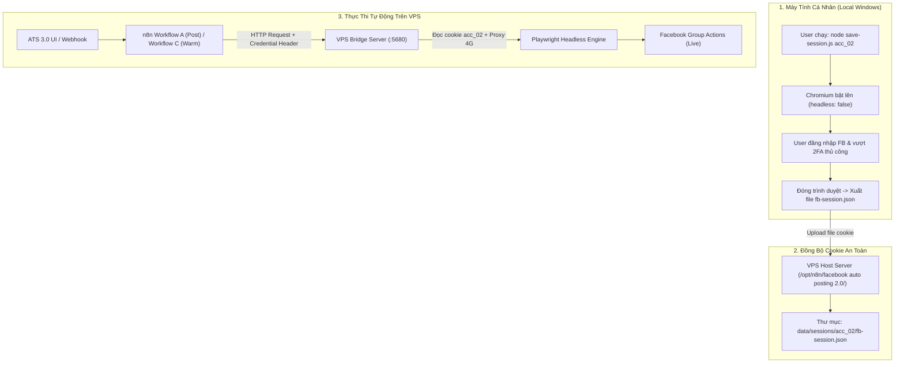

# BÁO CÁO ĐIỀU TRA KỸ THUẬT: KHẢ NĂNG MIGRATE SECTION "NICK FB CHÍNH" TỪ WORKFLOW N8N DOCKER LOCAL SANG VPS N8N

**Từ:** Antigravity (Lead Technical Architect & Implementer)  
**Gửi tới:** User & Claude (Architect/QA của dự án ATS 3.0)  
**Ngày:** 2026-09-06  
**Phạm vi:** Điều tra tĩnh, phân tích mã nguồn & đối soát dữ liệu (Read-only). **KHÔNG thực hiện bất kỳ thay đổi nào trên DB, n8n production, hay tài khoản Facebook thật.**

---

## 1. Bối Cảnh & Mục Tiêu Điều Tra

User muốn xem xét khả năng migrate một phần workflow n8n cũ (đang chạy trên môi trường Docker local) — cụ thể là section liên quan đến **"Nick FB Chính"** — sang instance n8n trên VPS (`n8n.example.com`, nơi đang chạy các Workflow A, B, C của ATS 3.0).

Mục tiêu chính là tìm phương án tối ưu để quản lý và thiết lập session cookie cho tài khoản Facebook mà không cần xây dựng thêm hạ tầng remote desktop phức tạp (noVNC đã quyết định gác lại cho các phiên bản sau).

---

## 2. Kết Quả Điều Tra Chi Tiết (4 Câu Hỏi Trọng Tâm)

### 2.1. Section "Nick FB Chính" trong workflow Docker cũ làm CHÍNH XÁC những gì?

Qua việc quét toàn bộ 62 workflows trong SQLite database của n8n local (`C:\Users\trith\.n8n\database.sqlite`) và các file blueprint trong thư mục `facebook auto posting/`:

- Workflow cũ duy nhất xử lý Facebook trên Docker local là: **`W3N7EpO76M3GuFrb` ("FB Group Auto-Post (Campaign) v2 Multi-Job")**, gồm 28 nodes.
- **Quy trình hoạt động từng bước của workflow này:**
  1. Trigger từ Notion Database (`84a5b1e22e1643de95e5966cf44da725`) khi Campaign ở trạng thái `Ready`.
  2. Lấy danh sách nhóm Facebook liên kết trong Notion, lọc cooldown 24h từ Posting Logs (`05301c69-ca4e-41b4-929f-193a000dd95f`).
  3. Gửi tin nhắn Telegram kèm liên kết n8n Form (`Wait for Approval`) để người dùng duyệt bài (`Approve` / `Skip`).
  4. Khi người dùng duyệt `Approve`, Node `Write Temp File` (`n_prep_post`) ghi một file JSON tạm vào thư mục `os.tmpdir()`.
  5. **Node `Post to Facebook Execute` (`n_exec_post`) — loại node `n8n-nodes-base.executeCommand`** thực thi lệnh shell:
     ```cmd
     set "NODE_PATH=C:\n8n-facebook-poster\node_modules" && cd /d "C:\n8n-facebook-poster" && node "G:\My Drive\AI project\ATS\facebook auto posting\run-batch.js" "{{$json.tempFile}}"
     ```
  6. Script `run-batch.js` gọi `post-to-group.js`, khởi chạy Playwright headless đọc file session cookie tĩnh có sẵn tại `G:\My Drive\AI project\ATS\facebook auto posting\data\fb-session.json`.
  7. Nhận kết quả stdout, ghi log trở lại Notion database và gửi báo cáo hoàn thành qua Telegram bot.

> **KẾT LUẬN CÂU 1:**
> - Trong workflow n8n Docker cũ **HOÀN TOÀN KHÔNG CÓ luồng đăng nhập hay lưu session**.
> - Đây đơn thuần là một **luồng đăng bài tự động (Posting Dispatcher)** chạy Playwright headless trên máy local đọc file cookie có sẵn.
> - Việc đăng nhập và tạo session cookie (`fb-session.json`) trong hệ thống cũ **luôn được làm thủ công ngoài n8n** thông qua script `save-session.js` (mở trình duyệt có giao diện `headless: false`, User tự gõ tài khoản/mật khẩu/2FA, rồi Playwright export cookie ra file JSON khi tắt trình duyệt).

---

### 2.2. Account "Nick Chính" tương ứng với DÒNG NÀO trong bảng `fb_accounts` của ATS 3.0?

Đối soát trực tiếp giữa file session cookie của workflow cũ với database Supabase của ATS 3.0 (`sandbox.fb_accounts`):

#### A. Trích xuất Facebook User ID (`c_user`) từ file Cookie cũ:
- Đường dẫn file session của workflow cũ: `G:\My Drive\AI project\ATS\facebook auto posting\data\fb-session.json`.
- Dung lượng: **4,392 bytes** (9 cookies).
- Cookie `c_user` (Facebook UID toàn cầu): **`100002837665053`**.

#### B. Đối chiếu với bảng `sandbox.fb_accounts` trong Supabase:
Account "Nick Chính" tương ứng **100% CHÍNH XÁC** với bản ghi sau:
- **`id` (UUID):** `01a071c3-eb55-a4e0-8a64-e28098a8dbd5`
- **`account_ref`:** **`acc_02`**
- **`account_name`:** **`Nick Chính`**
- **`fb_profile_url`:** `https://www.facebook.com/profile.php?id=100002837665053` *(UID `100002837665053` khớp 100% với `c_user` trong cookie cũ)*
- **`status`:** `Active` | **`daily_quota`:** 6 | **`reset_ip_url`:** mProxy key `bczfT6JAh45BUgvc`

```
BẢNG ĐỐI SOÁT TÀI KHOẢN FACEBOOK TRONG ATS 3.0:
┌─────────────┬──────────────────────┬─────────────────┬────────────────────────────────────────────────────────┬────────────────────────────────────────┐
│ Account Ref │ Account Name         │ Facebook UID    │ Profile URL                                            │ Session Cookie Path (VPS)              │
├─────────────┼──────────────────────┼─────────────────┼────────────────────────────────────────────────────────┼────────────────────────────────────────┤
│ acc_01      │ Nick Phụ Nguyen Thuy │ 61590711833457  │ https://www.facebook.com/profile.php?id=61590711833457 │ .../sessions/acc_01/fb-session.json    │
│ acc_02      │ Nick Chính (Main)    │ 100002837665053 │ https://www.facebook.com/profile.php?id=100002837665053 │ .../sessions/acc_02/fb-session.json    │
└─────────────┴──────────────────────┴─────────────────┴────────────────────────────────────────────────────────┴────────────────────────────────────────┘
```

> ⚠️ **LƯU Ý ĐẶC BIỆT VỀ NHÃN TÀI KHOẢN:**
> - Trong một số file blueprint nháp ban đầu (v3), từng có ghi chú thử nghiệm gán `acc_01 = Nick 01 (Main)`.
> - **NHƯNG trong database production ATS 3.0 thực tế (từ SNAP-77):**
>   - **`acc_01`** = `Nick Phụ Nguyen Thuy` (UID `61590711833457`).
>   - **`acc_02`** = **`Nick Chính`** (UID `100002837665053`).
> - File cookie của `acc_02` trên VPS (`/opt/n8n/facebook auto posting 2.0/data/sessions/acc_02/fb-session.json`) có dung lượng và hash khớp 100% với file cookie của workflow Docker cũ (cùng 4,392 bytes, UID `100002837665053`).

---

### 2.3. Workflow cũ dùng loại node nào? Có phụ thuộc môi trường Docker local không?

- **Loại node:** Sử dụng **`n8n-nodes-base.executeCommand`** (Execute Command node).
- **Lệnh thực thi trong node `n_exec_post`:**
  ```cmd
  set "NODE_PATH=C:\n8n-facebook-poster\node_modules" && cd /d "C:\n8n-facebook-poster" && node "G:\My Drive\AI project\ATS\facebook auto posting\run-batch.js" "{{$json.tempFile}}"
  ```
- **Các phụ thuộc môi trường CỨNG chỉ có trên Docker / Host Windows local:**
  1. **Đường dẫn ổ đĩa Windows:** `C:\n8n-facebook-poster\node_modules` và `G:\My Drive\AI project\ATS\facebook auto posting\run-batch.js`.
  2. **Playwright binary cục bộ:** Phụ thuộc vào browser binary cài trực tiếp trên máy host Windows.
  3. **File system local:** Ghi file tạm qua `os.tmpdir()` của Windows và đọc file cookie từ ổ `G:`.
  4. **Notion API Schema cũ:** Toàn bộ dữ liệu đọc/ghi của workflow cũ phụ thuộc vào Notion API (`databaseId: 84a5b1e2...` và `05301c69...`), hoàn toàn không tương thích với schema PostgreSQL/Supabase của ATS 3.0.

- **So sánh với kiến trúc VPS hiện tại:**
  - Trên VPS n8n hiện tại (`n8n.example.com`), n8n **không chạy Execute Command trực tiếp**, mà gọi HTTP Request sang **VPS Bridge Server** (`bridge-server.js` chạy trên host Linux VPS cổng `5680`).
  - VPS Bridge Server đã đóng gói sẵn: môi trường Linux, Playwright engine, Chromium headless, quản lý session đa tài khoản độc lập (`/opt/n8n/facebook auto posting 2.0/data/sessions/{accountId}/fb-session.json`), và proxy rotation.

---

### 2.4. Vấn đề Credentials & Node Types khi migrate sang VPS n8n

1. **Node Types:**
   - 100% node trong workflow cũ (`webhook`, `httpRequest`, `code`, `wait`, `telegram`, `if`, `executeCommand`) đều là core nodes chuẩn của n8n. VPS n8n hiện tại có đủ, không thiếu bất kỳ community node nào.
2. **Credentials:**
   - Workflow cũ dùng credential `notionApi` (`JAhdVAxbavxtlkf9`) và `telegramApi` (`eu2uYzaQm5itAPPm`).
   - Notion credentials **hoàn toàn không cần thiết nữa** vì ATS 3.0 đã chuyển sang Supabase.
   - VPS n8n hiện tại đã có sẵn các Credentials chuẩn của ATS 3.0: `Je1dHcRXyZhrXODl` (Internal Webhook Secret) và `wQ16G6l04h4gP5wF` (VPS Bridge Secret).
3. **Về bài toán "Setup Session FB không cần noVNC":**
   - Workflow n8n (dù ở local hay VPS) đều **không thể tự động đăng nhập FB từ con số 0** nếu không có sự can thiệp của người dùng (do cơ chế bảo mật 2FA, Checkpoint, Captcha của Facebook).
   - Tuy nhiên, **hoàn toàn không cần đến hạ tầng noVNC trên VPS**: User có thể chạy script `save-session.js acc_02` trên máy tính Windows cá nhân (có giao diện Chrome bật lên để User đăng nhập an toàn), sau đó chỉ cần đồng bộ file `fb-session.json` kết quả lên VPS.

---

## 3. Kiến Trúc Quản Lý Session Khuyến Nghị (Zero-noVNC Workflow)



---

## 4. Đề Xuất Phương Án Dự Kiến (Chờ Claude Review — Chưa Thực Thi)

> 🛑 **LƯU Ý:** Đây là phương án đề xuất trên giấy để phục vụ thẩm định kỹ thuật, **CHƯA ĐƯỢC THỰC HIỆN**.

1. **Không migrate workflow cũ nguyên bản:**
   - Không nhập file JSON của workflow cũ lên VPS n8n vì nó chứa logic Notion cũ và lệnh `Execute Command` cục bộ.
   - Thay vào đó, **Workflow A** (`9W588GooZeZhiSKm`) và **Workflow C** (`L8QdckqW7FDwanRq`) trên VPS n8n hiện tại **đã được thiết kế sẵn để hỗ trợ cả `acc_02` (Nick Chính) lẫn `acc_01` (Nick Phụ)** thông qua VPS Bridge Server.

2. **Quy trình quản lý Session FB định kỳ (Zero-noVNC Pattern):**
   - **Bước 1 (Capture Session Local):** Khi cookie của `acc_02` hết hạn hoặc cần đăng nhập lại, User chạy lệnh trên máy cá nhân:
     ```bash
     node save-session.js acc_02
     ```
     Cửa sổ trình duyệt xuất hiện trên máy tính của User, User đăng nhập Facebook bình thường. Khi đóng trình duyệt, file `fb-session.json` được tạo ra trong thư mục `facebook auto posting 2.0/data/sessions/acc_02/`.
   - **Bước 2 (Sync Session lên VPS):** Đồng bộ file `fb-session.json` vừa tạo vào đúng thư mục `/opt/n8n/facebook auto posting 2.0/data/sessions/acc_02/fb-session.json` trên VPS (qua SFTP/SCP hoặc qua endpoint an toàn `POST /api/upload-session` trên VPS Bridge với token xác thực).
   - **Bước 3 (Health Check Session):** VPS Bridge kiểm tra tính hợp lệ của cookie (gọi thử trang cá nhân không gây tương tác ghi) trước khi cho phép Workflow A/C dispatch tác vụ thật.

---

## 5. Tài Liệu Tham Khảo Liên Quan

- `g:\My Drive\AI project\ATS\facebook auto posting\fb_group_auto_post_v2_blueprint.json` (Workflow cũ).
- `g:\My Drive\AI project\ATS\facebook auto posting 2.0\save-session.js` (Multi-Account session capture tool).
- `docs/architecture/BLUEPRINT_2026-09-04_fb-account-warming-and-rotation-strategy.md` (Blueprint nuôi nick & luân chuyển tài khoản).
- `docs/testing/FIX_SPEC_2026-09-06_campaign-fb-autopost_phase4b-hardening-before-activation.md` (Workflow A hardening spec).
