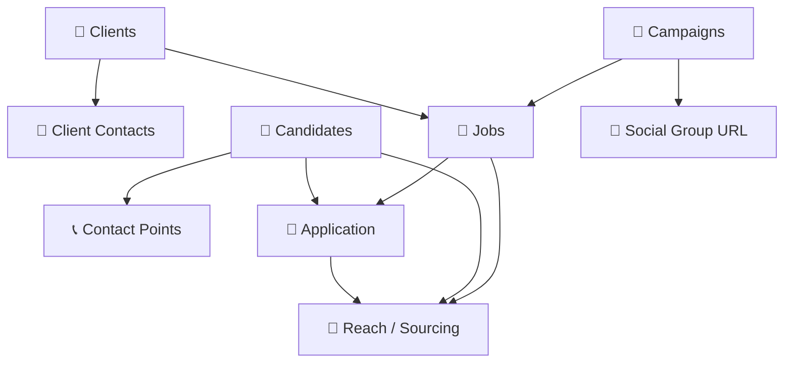

# CRM-ATS V2 — Headhunter Workspace Schema

> **Auto-generated**: 2026-05-30
> **Last Update**: 2026-06-05 (Added Interview DB & N8N Automation Blueprint)

## Changelog
- **2026-06-10:** Bổ sung tích hợp và viết Blueprint kỹ thuật cho 2 workflow: Main workflow `CV Parser → Notion ATS Dedup` và Sub-workflow `PDF Scan OCR - Gemini API` (sử dụng Gemini 2.5 Flash API).
- **2026-06-05 (Final Fix):** Hoàn thiện hệ thống N8N Automation Workflow: sửa lỗi định danh Page ID bằng cách lấy trực tiếp từ node nguồn, cấu hình chính xác Native HTTP Request Node có nhúng API Credential để cập nhật Status trang Notion. Tự động hóa 100% việc đặt lịch phỏng vấn, hỏi ý kiến qua Telegram và cập nhật kết quả "Completed" vào hệ thống.
- **2026-06-05:** Cập nhật chi tiết cấu trúc Database Interview. Tích hợp logic tự động hóa n8n (Telegram Approval & Google Calendar Event).
- **2026-05-30:** Khởi tạo tài liệu Schema v2. | **Workspace**: [CRM-ATS V2](https://www.notion.so/thucnguyen/CRM-ATS-V2-Headhunter-Workspace-3330900c70518100bcdaf3685401d992)
> Hệ thống CRM-ATS Version 2 cho headhunting business. Kiến trúc relational database tối ưu, tránh trùng lặp dữ liệu, scalable.

## Workspace Tabs Overview

| # | Tab Name | Database | Database ID | Status |
|---|----------|----------|-------------|--------|
| 1 | Application | 📝 Application | `3440900c-7051-8082-9dc6-fdee16409f1c` | ✅ Active |
| 2 | Reach / Sourcing | 📝 Reach / Sourcing | `e0585fe7-5ad8-40a5-b3a8-891caa047381` | ✅ Active |
| 3 | Candidates | 👤 Candidates | `a1f6d984-3196-4934-bf8e-94284788e2b7` | ✅ Active |
| 4 | Contact Points | 📞 Contact Points | `6d8b17c5-940a-492f-b2d9-13b6788a2079` | ✅ Active |
| 5 | Client | 🏢 Clients | `026c9128-4f10-4f3d-bd5f-a8563618b3cf` | ✅ Active |
| 6 | Client Contacts | 👔 Client Contacts | `5ed1414e-50c3-42e4-af6c-df77c036429c` | ✅ Active |
| 7 | Jobs | 💼 Jobs | `ad00f3d9-03dc-4275-b276-6c48146fe0c2` | ✅ Active |
| 8 | Campaigns | 📣 Campaigns | `84a5b1e2-2e16-43de-95e5-966cf44da725` | ✅ Active |
| 9 | Social Group URL | 🔗 Social Group URL | `3700900c-7051-8089-871e-e32c239cab43` | ✅ Active (NEW) |
| 10 | Interview | 🗓️ Interview | ý0900c-7051-806a-80e1-d0e36cc72804 | ✅ Active |

## Relational Architecture

---

## Database Schemas

---

### 1. 🏢 Clients
- **Database ID**: `026c9128-4f10-4f3d-bd5f-a8563618b3cf`

| Property | Type | Details |
|----------|------|---------|
| `Name` | title | Tên công ty khách hàng |
| `ID_Client` | unique_id | Auto-increment |
| `Status` | select | Options: `Active`, `Potential`, `Inactive` |
| `Industry` | select | Options: `IT/Software`, `Consulting`, `Manufacturing`, `Finance`, `Healthcare`, etc. |
| `Location` | select | Options: `Hồ Chí Minh`, `Hà Nội`, `Đà Nẵng`, etc. |
| `TaxCode` | rich_text | Mã số thuế |
| `Address` | rich_text | Địa chỉ |
| `Notes` | rich_text | Ghi chú |
| `Jobs` | relation | → `Jobs` (synced: `Client`) |
| `Contacts` | relation | → `Client Contacts` (synced: `Client`) |
| `ID_Client_Contact` | rollup | Rollup `ID_Client_Contact` via `Contacts` |
| `Demo` | select | Options: `Demo` |
| `Created` | created_time | Auto |
| `Last Updated` | last_edited_time | Auto |

---

### 2. 👤 Candidates
- **Database ID**: `a1f6d984-3196-4934-bf8e-94284788e2b7`
- **Description**: Ứng viên trong hệ thống

| Property | Type | Details |
|----------|------|---------|
| `Full Name` | title | Tên ứng viên |
| `ID_Candidate` | unique_id | Auto-increment |
| `Prefix` | select | Options: `Mr`, `Ms` |
| `Source` | select | Options: `LinkedIn`, `Referral`, `Sourced`, `CV Parsing`, `Vietnamwork`, `Self-applied`, etc. |
| `DOB` | date | Ngày sinh |
| `Address` | place | Địa chỉ (Location/Place) |
| `Notes` | rich_text | Ghi chú |
| `CV` | files | File đính kèm CV |
| `Blocked` | checkbox | Đánh dấu ứng viên bị block |
| `Blacklist Note` | rich_text | Lý do blacklist |
| `Contact Points` | relation | → `Contact Points` (synced: `Candidate`) |
| `ID_ContactPoints` | rollup | Rollup `ID_Contactpoints` via `Contact Points` |
| `Application` | relation | → `Application` (synced: `👤 Candidates`) |
| `📝 Reach / Sourcing` | relation | → `Reach / Sourcing` (synced: `👤 Candidates`) |
| `Save Contact` | button | Button (UI only) |
| `Demo` | select | Options: `Demo` |
| `Created Time` | created_time | Auto |
| `Last Updated` | last_edited_time | Auto |

---

### 3. 📞 Contact Points
- **Database ID**: `6d8b17c5-940a-492f-b2d9-13b6788a2079`
- **Description**: Multi-contact cho ứng viên: email, phone, social links. Tách từ 15 cột contact trong CandidateDB gốc.

| Property | Type | Details |
|----------|------|---------|
| `Value` | title | Email, phone number hoặc URL |
| `ID_Contactpoints` | unique_id | Auto-increment |
| `Candidate` | relation | → `Candidates` (synced: `Contact Points`) |
| `ID_Candidate` | rollup | Rollup `ID_Candidate` via `Candidate` |
| `Type` | select | Options: `Email`, `Phone`, `LinkedIn`, `Facebook`, `Zalo`, `Skype`, `Github`, `Behance`, `Dribbble`, `StackOverflow`, `Twitter`, `Vietnamwork`, `Careerbuilder`, `Personal Website`, `PersonalWebsiteBlog`, `Other` |
| `Demo` | select | Options: `Demo` |
| `CreatedTime` | created_time | Auto |
| `LastUpdated` | last_edited_time | Auto |

---

### 4. 💼 Jobs
- **Database ID**: `ad00f3d9-03dc-4275-b276-6c48146fe0c2`

| Property | Type | Details |
|----------|------|---------|
| `Job Title` | title | Tên vị trí tuyển dụng |
| `ID_Job` | unique_id | Auto-increment |
| `Client` | relation | → `Clients` (synced: `Jobs`) |
| `ID_Client` | rollup | Rollup `ID_Client` via `Client` → show_original |
| `Status` | select | Options: `Open`, `Closed`, `On Hold` |
| `Priority` | select | Options: `1`, `2`, `3` |
| `Working Mode` | select | Options: `Hybrid`, `In Office`, `Remote` |
| `Min Salary (USD)` | number | Lương tối thiểu |
| `Max Salary (USD)` | number | Lương tối đa |
| `JD (Text)` | rich_text | Mô tả công việc (text) |
| `JD` | files | JD dạng file đính kèm |
| `Location` | place | Địa điểm làm việc |
| `Notes` | rich_text | Ghi chú |
| `Assigned To` | people | Recruiter phụ trách |
| `Application` | relation | → `Application` (synced: `📋 Jobs`) |
| `Candidates` | rollup | Rollup candidates via `Application` |
| `Candidate` | rollup | Rollup candidates via `Application` → show_original |
| `📝 Tasks / Actions ` | relation | → `Reach / Sourcing` (synced: `📋 Jobs`) |
| `ID_Task` | rollup | Rollup via `📝 Tasks / Actions ` |
| `Demo` | select | Options: `Demo` |
| `Created` | created_time | Auto |
| `Last Updated` | last_edited_time | Auto |

---

### 5. 👔 Client Contacts
- **Database ID**: `5ed1414e-50c3-42e4-af6c-df77c036429c`
- **Description**: Đầu mối liên lạc của Client (HR Manager, Hiring Manager, POC).

| Property | Type | Details |
|----------|------|---------|
| `Name` | title | Tên người liên lạc |
| `ID_Client_Contact` | unique_id | Auto-increment |
| `Client` | relation | → `Clients` (synced: `Contacts`) |
| `ID_Client` | rollup | Rollup `ID_Client` via `Client` |
| `Type` | select | Options: `Email`, `Phone`, `LinkedIn`, `Zalo`, `Other` |
| `Contact Value` | rich_text | Email, SĐT hoặc link |
| `Job Title` | rich_text | Chức vụ tại client |
| `Primary` | checkbox | POC chính |
| `Notes` | rich_text | Ghi chú |
| `Demo` | select | Options: `Demo` |

---

### 6. 📝 Application
- **Database ID**: `3440900c-7051-8082-9dc6-fdee16409f1c`
- **Description**: Kết nối ứng viên với job (Candidate × Job = Application).

| Property | Type | Details |
|----------|------|---------|
| `Summary` | title | Tóm tắt: Candidate → Job |
| `ID_Application` | unique_id | Auto-increment |
| `👤 Candidates` | relation | → `Candidates` (synced: `Application`) |
| `ID_Candidate` | rollup | Rollup `ID_Candidate` via `👤 Candidates` |
| `📋 Jobs` | relation | → `Jobs` (synced: `Application`) |
| `ID_Job` | rollup | Rollup `ID_Job` via `📋 Jobs` |
| `Status` | status | Options: `Not started`, `In progress`, `Done` |
| `Stage` | select | Options: `Applied`, `Reaching Out`, `Phone Screen`, `Send CV to Client`, `1st Interview`, `2nd Interview`, `Offer`, `Hired`, `Failed`, `Canceled` |
| `Priority` | select | Options: `1`, `2`, `3` |
| `Source` | select | Options: `Linkedin`, `Referral`, `Facebook`, `Zalo`, `Email`, etc. |
| `Result` | select | Kết quả cuối |
| `Reason (if failed)` | select | Lý do thất bại |
| `Note` | rich_text | Ghi chú |
| `Note (Failure Reason)` | rich_text | Ghi chú thất bại |
| `Passive Candidate?` | checkbox | Ứng viên passive |
| `Blacklist` | rollup | Rollup `Blocked` via `👤 Candidates` |
| `Assigned To` | people | Recruiter phụ trách |
| `Due Date` | date | Hạn chót |
| `Due Date Status` | formula | Trạng thái deadline |
| `📝 Reach / Sourcing` | relation | → `Reach / Sourcing` (synced: `📥 Application`) |
| `Parent item` | relation | Self-relation (parent) |
| `Sub-item` | relation | Self-relation (sub-items) |
| `Demo` | select | Options: `demo` (lowercase) |
| `Created time` | created_time | Auto |
| `Last edited time` | last_edited_time | Auto |
| `Created by` | created_by | Auto |
| `Last edited by` | last_edited_by | Auto |

---

### 7. 📝 Reach / Sourcing
- **Database ID**: `e0585fe7-5ad8-40a5-b3a8-891caa047381`
- **Description**: Tracking touchpoints, logs, sourcing steps trên application.

| Property | Type | Details |
|----------|------|---------|
| `Summary` | title | Tóm tắt hành động |
| `ID_Reach` | unique_id | Auto-increment |
| `👤 Candidates` | relation | → `Candidates` (synced: `📝 Reach / Sourcing`) |
| `ID_Candidate` | rollup | Rollup `ID_Candidate` via `👤 Candidates` |
| `📋 Jobs` | relation | → `Jobs` (synced: `📝 Tasks / Actions `) |
| `ID_Job` | rollup | Rollup `ID_Job` via `📋 Jobs` |
| `📥 Application` | relation | → `Application` (synced: `📝 Reach / Sourcing`) |
| `Status` | status | Options: `Not started`, `In Progress`, `Done` |
| `Stage` | select | Options: `Sourcing`, `Reaching`, `Sending JD`, `Interview Scheduling`, etc. |
| `Channel` | select | Options: `Linkedin`, `Email`, `Zalo`, `Facebook`, `Phone`, etc. |
| `Priority` | select | Options: `1`, `2`, `3` |
| `Result` | select | Kết quả |
| `Reason (If Failed OR Canceled)` | select | Lý do thất bại/hủy |
| `Note` | rich_text | Ghi chú |
| `Note (For Failure Or Cancelation)` | rich_text | Ghi chú thất bại |
| `Contact Points (For Searching Only)` | rollup | Rollup `Contact Points` via `👤 Candidates` |
| `Assigned To` | people | Recruiter phụ trách |
| `Due Date` | date | Hạn chót |
| `Place` | place | Địa điểm |
| `Parent item` | relation | Self-relation (parent) |
| `Sub-item` | relation | Self-relation (sub-items) |
| `Parent Task` | relation | Self-relation (parent task) |
| `Demo` | select | Options: `Demo` |
| `Created` | created_time | Auto |

---

### 8. 📣 Campaigns
- **Database ID**: `84a5b1e2-2e16-43de-95e5-966cf44da725`

| Property | Type | Details |
|----------|------|---------|
| `Campaign Name` | title | Tên chiến dịch |
| `Status` | select | Trạng thái chiến dịch |
| `Channel` | select | Kênh triển khai |
| `📋 Jobs` | relation | → `Jobs` |
| `🔗 Social Group URL` | relation | → `Social Group URL` (synced: `📣 Campaigns`) |
| `Message Template` | rich_text | Mẫu tin nhắn |
| `Target Criteria` | rich_text | Tiêu chí đối tượng |
| `Start Date` | date | Ngày bắt đầu |
| `End Date` | date | Ngày kết thúc |
| `Total Sent` | number | Tổng số đã gửi |
| `Total Replied` | number | Tổng số phản hồi |
| `Notes` | rich_text | Ghi chú |
| `Created` | created_time | Auto |
| `Last Updated` | last_edited_time | Auto |

---

### 9. 🔗 Social Group URL _(NEW)_
- **Database ID**: `3700900c-7051-8089-871e-e32c239cab43`
- **Description**: Danh sách các nhóm mạng xã hội (Facebook Groups, LinkedIn Groups, etc.) để đăng tuyển dụng.

| Property | Type | Details |
|----------|------|---------|
| `Name` | title | Tên nhóm |
| `URL` | url | Link đến nhóm |
| `📣 Campaigns` | relation | → `Campaigns` (synced: `🔗 Social Group URL`) |
| `Group Type` | multi_select | Options: `Tech`, `Nontech`, `IT`, `Cosmetic`, `CosmeticNontech` |

---

### 10. 🗓️ Interview
- **Database ID**: ý0900c-7051-806a-80e1-d0e36cc72804\n- **Description**: Database quản lý lịch phỏng vấn và kích hoạt automation n8n tạo sự kiện Google Calendar.

| Property | Type | Details |
|----------|------|---------|
| Title | title | Tên lịch phỏng vấn |
| Application | relation | → Application (synced: Interview) |
| Job | rollup | Rollup 📋 Jobs via Application → show_original |
| Candidate | rollup | Rollup 👤 Candidates via Application → show_original |
| Client | formula | Truy xuất Name qua chuỗi Relation (Job → Client) |
| Interview Location | formula | Truy xuất Address qua chuỗi Relation (Job → Client) |
| Date | date | Thời gian bắt đầu và kết thúc phỏng vấn |
| Duration (minutes) | number | Thời lượng (VD: 60) |
| Interviewer | people | Người phỏng vấn (dùng để gửi thư mời qua n8n) |
| Calendar Group Email | email | Email nhận thư mời phụ (ví dụ: hr@company.com). Trống thì bỏ qua. |
| Select | select | Options: Draft, Ready |
| Email Language | select | Options: Vietnamese |
| Send interview Invite | button | Button kích hoạt nội bộ (nếu cần) |

---

## Cross-Reference: Relation Map

| From DB | Property | → To DB | Synced Property |
|---------|----------|---------|-----------------|
| Clients | `Jobs` | Jobs | `Client` |
| Clients | `Contacts` | Client Contacts | `Client` |
| Candidates | `Contact Points` | Contact Points | `Candidate` |
| Candidates | `Application` | Application | `👤 Candidates` |
| Candidates | `📝 Reach / Sourcing` | Reach / Sourcing | `👤 Candidates` |
| Jobs | `Application` | Application | `📋 Jobs` |
| Jobs | `📝 Tasks / Actions ` | Reach / Sourcing | `📋 Jobs` |
| Application | `📝 Reach / Sourcing` | Reach / Sourcing | `📥 Application` |
| Campaigns | `🔗 Social Group URL` | Social Group URL | `📣 Campaigns` |
| Campaigns | `📋 Jobs` | Jobs | — |

---

## N8N Automation Workflows

### 1. Interview Scheduler with Telegram Approval
- **Blueprint Location**: `g:\My Drive\AI project\My Porfolio\blue print\n8n-interview-scheduler-blueprint.json`
- **Trigger**: Notion Webhook (listen on `interview-trigger` path). Triggered khi tạo/update Interview page có Status chuyển sang `Ready`.
- **Logic Flow**:
  1. Lấy thông tin **Interview**, truy xuất ID của Job và Candidate tương ứng.
  2. Lấy dữ liệu **Job** (tiêu đề, địa điểm), **Candidate** (Tên), **Contact Points** (Email ứng viên).
  3. Kiểm tra xem ứng viên có Email không. Nếu không, bắn cảnh báo **Error Alert** sang Telegram cho nhóm tuyển dụng.
  4. Gửi **Approval Request** qua Telegram bot có 2 nút [Approve] và [Reject] kèm tóm tắt chi tiết lịch phỏng vấn.
  5. Khi ai đó bấm nút:
     - **[Reject]**: Bắn thông báo bị từ chối về Telegram. Dừng quy trình.
     - **[Approve]**: Bắn thông báo xác nhận đã duyệt, tiếp tục tiến trình:
       - Tạo một event mới trên **Google Calendar** mời cả ứng viên (qua email) và người phỏng vấn. Tiêu đề event: `[Candidate Name] - [Job Title] - [Client Name]`.
       - Mượn API credentials để bắn một HTTP Request vá cập nhật lại trạng thái `Select` của thẻ Interview trên Notion thành **Completed**.

### 2. CV Parser → Notion ATS Dedup (Main Workflow)
- **Blueprint Location**: [N8N_CV_Parser_Notion_ATS_Dedup_Blueprint.md](file:///g:/My%20Drive/AI%20project/My%20Porfolio/blue%20print/N8N_CV_Parser_Notion_ATS_Dedup_Blueprint.md)
- **Trigger**: Telegram Trigger `/parse` (nhận file CV gửi kèm caption từ Telegram Bot) hoặc Form Upload Trigger (n8n Form trực quan).
- **Logic Flow**:
  1. **Nhận CV**: Nhận tệp CV qua Form tải lên hoặc Telegram.
  2. **Phân loại & Trích xuất Links**: Đọc cấu trúc nhị phân của tệp PDF để phát hiện xem là PDF chứa lớp text hay PDF dạng ảnh quét (scanned). Trích xuất các liên kết LinkedIn có sẵn.
  3. **Rẽ nhánh OCR**:
     - Nếu là file ảnh hoặc scanned PDF (`is_scanned = true`), gọi sub-workflow **PDF Scan OCR - Gemini API** để nhận diện văn bản.
     - Nếu là text-based PDF, bỏ qua OCR để đi thẳng tới bước trích xuất.
  4. **Trích xuất thông tin AI**: Gửi nội dung văn bản tới Claude 3.5 Sonnet để phân tích thành cấu trúc dữ liệu JSON (Thông tin ứng viên & Contact Points).
  5. **Chuẩn hóa thông tin**: Chuẩn hóa số điện thoại sang định dạng đầu số quốc tế (`+84`), email (về chữ thường), LinkedIn URL và chuẩn hóa tên ứng viên (bỏ dấu tiếng Việt).
  6. **Kiểm tra trùng lặp (Deduplication)**: Thực hiện truy vấn (OR filter) trong Notion Database `Contact Points` với các giá trị Email, SĐT, LinkedIn vừa trích xuất.
  7. **Định tuyến (Switch)**:
     - **Không trùng (0 Match)**: Tạo ứng viên mới trên Notion Candidates DB, tạo các bản ghi liên kết mới trên Contact Points DB, tải CV lên Google Drive, đính kèm link Drive vào trang ứng viên, gửi thông báo Telegram.
     - **Trùng 1 ứng viên (1 Match)**: Cập nhật ghi chú và lưu file CV mới vào trang ứng viên sẵn có trên Notion, lọc và tạo thêm các Contact Points mới (nếu có), gửi thông báo Telegram.
     - **Trùng nhiều hơn 1 ứng viên (>1 Match)**: Gửi thông báo cảnh báo xung đột (Conflict) về Telegram để Admin xử lý thủ công.

### 3. PDF Scan OCR - Gemini API (Sub-workflow)
- **Blueprint Location**: [N8N_PDF_Scan_OCR_Gemini_API_Blueprint.md](file:///g:/My%20Drive/AI%20project/My%20Porfolio/blue%20print/N8N_PDF_Scan_OCR_Gemini_API_Blueprint.md)
- **Trigger**: Nhận tệp nhị phân đầu vào thông qua node `Execute Workflow Trigger` từ workflow chính.
- **Logic Flow**:
  1. **Lưu File Tạm**: Lưu file nhị phân đầu vào thành file vật lý trong thư mục tạm hệ thống (`Temp`).
  2. **Kiểm tra loại file**: Rẽ nhánh xem file là hình ảnh hay PDF.
     - **Nếu là Hình ảnh**: Đọc trực tiếp, mã hóa Base64 và gửi lên Google Gemini 2.5 Flash API qua node HTTP Request.
     - **Nếu là PDF scan**: Sử dụng lệnh hệ thống `pdftoppm` (từ thư viện Poppler) để render tất cả các trang PDF thành ảnh PNG ở độ phân giải 200 DPI. Sau đó, chạy vòng lặp tuần tự đọc từng trang ảnh, mã hóa Base64 và gửi tới Gemini 2.5 Flash API.
  3. **Hợp nhất văn bản (Combine)**: Cộng dồn toàn bộ văn bản nhận diện được từ các trang đơn lẻ thành một chuỗi duy nhất và trả kết quả về cho workflow chính.
- **Cơ chế dự phòng lỗi**: Cấu hình tự động Retry tối đa 3 lần cho node API Gemini; đồng thời workflow chính cấu hình `Continue on Fail` tại node gọi sub-workflow để tránh dừng cả quy trình nếu OCR lỗi.
