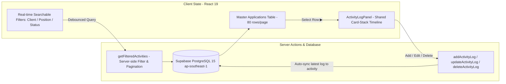

# Feature Guide: Action Menu Dashboard (`/`)

> **Route:** `http://localhost:3000/`  
> **Purpose:** Daily recruitment pipeline tracking, live candidate stage management, and unified activity logging.

---

## 1. State Flow & Architecture

## 2. Core Components & Hooks
* **`SearchableFilterDropdown`:** Real-time searchable combobox with option counters, active checkmark, and quick clear `✕`.
* **`Master Applications Table`:** Focused 80-row grid displaying Candidate, Job, Client, Stage, and Planning Date (Result/Reason moved to per-log timeline).
* **`Planning Date Overdue Indicator`:** Chỉ báo trực quan trạng thái ngày kế hoạch:
  * **Quá hạn (`planning_date < today`):** Tô màu đỏ cảnh báo (`bg-red-950 text-red-200 border-red-800`).
  * **Đúng hạn / Tương lai (`planning_date >= today`):** Hiển thị màu trung tính chuẩn (`bg-slate-900 text-slate-200 border-slate-700`).
  * **Trống / Chưa đặt:** Màu mờ (`text-slate-500`).
* **`ActivityLogPanel` (Shared):** Unified card-stack timeline displaying per-log Stage, Result (Pass/Fail), Reason (if Failed), Action Date, and Audit Timestamp (`created_time`).
* **`syncApplicationFromLogs`:** Automatically derives and syncs Application-level `current_stage`, `result`, `reason_failed`, `note_failure_reason` from the most recent log.

_Cập nhật bởi: Antigravity (Implementer) — 2026-09-07: Bổ sung đặc tả Planning Date Overdue Indicator cho bảng Action Menu._

