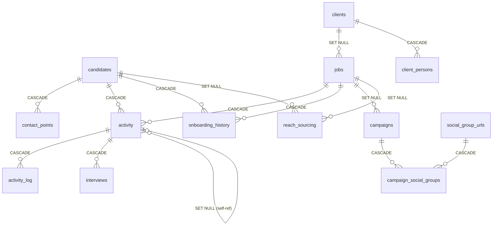

# 🔬 ATS 3.0 — Master Test Matrix (Bảng Kịch Bản Kiểm Thử Toàn Diện)

> **Prepared by:** Senior QA & Database Integrity Specialist  
> **Date:** 30/08/2026  
> **Target System:** CRM-ATS 3.0 (Next.js 14+ / Supabase PostgreSQL / Schema `sandbox`)  
> **Testing Philosophy:** Destructive Testing — tập trung phá vỡ hệ thống, tìm lỗi mất mát dữ liệu, xung đột state và edge cases nghiệp vụ tuyển dụng.

> [!IMPORTANT]
> Toàn bộ kịch bản dưới đây được xây dựng dựa trên phân tích thực tế mã nguồn (`actions.js` — 44 Server Actions, 0 transactions `sql.begin`), schema PostgreSQL (14 bảng, 17 Foreign Keys), và kiến trúc UI state management (3 workbench pages, 70+ state variables). Đây không phải test matrix lý thuyết — mỗi "Failure Risk" đều trỏ đến dòng code hoặc cơ chế cụ thể đã được kiểm chứng.

---

> [!NOTE]
> ### 🔄 Cập nhật 06/09/2026 — Xác nhận thực tế từ QA phiên Campaign FB Auto-Post
> - **DB-09 đã CONFIRMED xảy ra thật trong production** (không chỉ là rủi ro lý thuyết nữa): candidate #11853 "Pham Thi D" (tạo qua CV Parser auto-import) có 3 `contact_points` thật nhưng `candidates.phones/emails/all_contacts_text` hoàn toàn rỗng — tổng cộng **22 candidates** đang bị ảnh hưởng tại thời điểm phát hiện. Root cause thực tế hẹp hơn giả thuyết ban đầu: không phải do transaction thất bại giữa chừng, mà do 1 đường tạo candidate riêng (`src/app/api/webhooks/cv-import/route.js`, nhánh AUTO CREATE) chưa từng gọi logic đồng bộ cache — xem `FIX_SPEC_2026-09-06_candidates_contact-search-desync-and-accent-insensitive-search.md`.
> - **Phát hiện mới (chưa có trong bản gốc 30/08):** search toàn hệ thống (7+ hàm trong `actions.js`) chỉ `LOWER()` chứ chưa `unaccent()` — không tìm được khi gõ khác dấu tiếng Việt. Fix cùng file spec nêu trên (bật extension `unaccent`, áp dụng đồng bộ cho toàn bộ các hàm search).
> - **Nguyên tắc rút ra (áp dụng rộng hơn DB-09):** bất kỳ bảng nào có cột cache/denormalize (ví dụ `candidates.all_contacts_text`, hay bên Campaign là `campaigns.status` đồng bộ từ `campaign_runs`/`warm_join_runs`) đều cần audit **TẤT CẢ** đường ghi dữ liệu gốc (không chỉ đường UI chính) để đảm bảo mọi đường đều đồng bộ cache — CV Import, bulk import, migration script, webhook,... KHÔNG chỉ đường tạo/sửa thủ công qua UI. Xem PHẦN 4 (mới) bên dưới — cùng nguyên tắc này áp dụng cho module Campaign FB Auto-Post.
> - Đã thêm **PHẦN 4** bên dưới, tổng hợp toàn bộ kịch bản QA cho module Campaign FB Auto-Post (Job Posting + Warming) — module hoàn toàn chưa có trong bản gốc 30/08 vì được xây dựng sau đó.
> - **Rà soát mở rộng (theo yêu cầu "rà lại toàn bộ"):** cùng lỗi denormalize-cache ở trên tìm thấy thêm **2 vị trí nữa** trong `src/app/hitl_actions.js` (luồng xử lý hàng đợi CV nghi trùng — HITL queue): hàm `createCandidateFromPayload` (nhánh FORCE_CREATE) và nhánh MERGE trong `resolvePendingCVImport`. Tổng cộng đã xác nhận **3 vị trí độc lập** cùng mắc lỗi này — xem `FIX_SPEC_2026-09-06_candidates_contact-search-desync-and-accent-insensitive-search.md` PHẦN C. Đã đối chiếu và loại trừ `cv-batch`/`cv-batch-item` webhooks (không đụng tới `contact_points` trực tiếp, không bị ảnh hưởng).
> - **Đã rà soát lại toàn bộ 10 rủi ro P0 gốc (30/08)** đối chiếu trực tiếp với code hiện tại — xem bảng "Top 10 Rủi Ro" cập nhật bên dưới (mục 📋). Tin tốt: **6/10 đã fix hoàn toàn, 3/10 giảm rủi ro đáng kể, chỉ còn 1/10 (UI-01 — rapid click stale state) nguyên trạng chưa ai đụng tới.**
> - Đã xác nhận thêm các điểm KHÁC cũng đã được hardening tốt kể từ 30/08 (không nằm trong Top 10 nhưng cùng nhóm rủi ro): `updateClientBranch` nay dùng `SELECT ... FOR UPDATE` trong transaction để tránh lost-update JSONB (DB-10), `addActivityLog`/`updateActivityLog` đã có transaction + guard "Closed" server-side (không chỉ chặn ở UI như BIZ-09 mô tả ban đầu).

---

## 📊 Tổng Quan Phân Bố Kịch Bản

| Mức Độ | Số Lượng | Ý Nghĩa |
| :---: | :---: | :--- |
| **P0 — Blocker** | 20 | Mất / hỏng dữ liệu Postgres, sai lệch hồ sơ ứng viên, crash giao diện |
| **P1 — Critical** | 22 | Sai lệch logic tuyển dụng, bỏ sót log, lỗi dedup, state hiển thị nhầm người |
| **P2 — Major** | 18 | Lỗi hiển thị UI, định dạng chuỗi/ngày tháng, bất tiện thao tác |
| **Tổng** | **60** | |

---

## PHẦN 1: DATABASE INTEGRITY & DATA LOSS (Tầng Supabase Postgres)

### 1A. Tính Toàn Vẹn Quan Hệ Cha-Con (Master-Detail Referential Integrity)

| ID | Tên Kịch Bản | P | Module & Tiền điều kiện | Các bước thực hiện (Steps) | Kết quả mong đợi | Hành vi lỗi tiềm ẩn (Failure Risk) |
| :---: | :--- | :---: | :--- | :--- | :--- | :--- |
| **DB-01** | **CASCADE xóa Candidate xóa sạch Activity + Logs + Contacts** | P0 | `candidates`, `activity`, `activity_log`, `contact_points`. Candidate có ≥2 applications, mỗi application có ≥3 activity logs, ≥4 contact points. | 1. Ghi nhận `candidate_id` của ứng viên test. 2. Thực thi `DELETE FROM candidates WHERE id = '<uuid>'` trực tiếp trên Supabase SQL Editor. 3. Kiểm tra `SELECT * FROM activity WHERE candidate_id = '<uuid>'`. 4. Kiểm tra `SELECT * FROM activity_log WHERE application_id IN (SELECT id FROM activity WHERE candidate_id = '<uuid>')`. 5. Kiểm tra `SELECT * FROM contact_points WHERE candidate_id = '<uuid>'`. | Tất cả records con phải bị xóa sạch (CASCADE). Không còn orphan records ở bất kỳ bảng phụ thuộc nào. | ✅ Đã có `ON DELETE CASCADE` trên `activity.candidate_id`, `contact_points.candidate_id`, `activity_log.application_id`. Tuy nhiên, cột denormalized `candidates.phones/emails/socials/all_contacts_text` không tồn tại trigger ngược — nếu có process khác cache candidate data trước khi xóa, cache sẽ chứa stale data. |
| **DB-02** | **CASCADE xóa Job xóa sạch Activity + Logs + Interviews + Onboarding nhưng GIỮA Client** | P0 | `jobs`, `activity`, `activity_log`, `interviews`, `onboarding_history`, `campaigns`. Job có ≥5 applications, ≥2 interviews, ≥1 onboarding record, ≥1 campaign. | 1. Ghi nhận `job_id` và `client_id` liên quan. 2. `DELETE FROM jobs WHERE id = '<job_uuid>'`. 3. Verify `activity`, `activity_log`, `interviews`, `onboarding_history` đều bị xóa cascade. 4. Verify `campaigns.job_id` = `NULL` (SET NULL, không xóa). 5. Verify `clients` record vẫn còn nguyên vẹn. | Tất cả application + logs + interviews + onboarding bị xóa. Campaign giữ nguyên với `job_id = NULL`. Client không bị ảnh hưởng. | `jobs.client_id ON DELETE SET NULL` → nếu xóa Client, jobs vẫn tồn tại nhưng mất liên kết. Cần kiểm tra UI có xử lý `client_name = null` trên bảng pipeline không. |
| **DB-03** | **Xóa Client → Jobs mồ côi (SET NULL) + cascade xóa Client Persons** | P0 | `clients`, `jobs`, `client_persons`. Client có ≥3 jobs, ≥2 client persons. | 1. `DELETE FROM clients WHERE id = '<client_uuid>'`. 2. Verify `jobs WHERE client_id = '<client_uuid>'` → `client_id` = NULL. 3. Verify `client_persons WHERE client_id = '<client_uuid>'` → xóa sạch (CASCADE). 4. Mở `/jobs` workbench → xem jobs mồ côi hiển thị thế nào. | Jobs tồn tại với `client_id = NULL`. Client persons bị xóa CASCADE. UI cần hiển thị "Unknown Client" hoặc similar fallback. | UI `jobs/page.js` sử dụng `client_name` từ JOIN. Nếu `client_id = NULL`, LEFT JOIN trả `null` → risk hiển thị chuỗi "null" trên giao diện thay vì fallback. |
| **DB-04** | **Xóa Activity (Application) → cascade Activity_log + Interviews** | P0 | `activity`, `activity_log`, `interviews`. Application có ≥5 logs, ≥1 interview. | 1. `DELETE FROM activity WHERE id = '<app_uuid>'`. 2. Verify `activity_log WHERE application_id = '<app_uuid>'` → 0 rows. 3. Verify `interviews WHERE application_id = '<app_uuid>'` → 0 rows. 4. Mở `/candidates` profile → check applications list cập nhật. | Toàn bộ timeline logs và interviews cascade xóa. Candidate profile vẫn tồn tại nhưng mất application này. | Trang `/candidates/page.js` cache `timelineLogs[applicationId]` và `expandedTimelines[applicationId]` trong state. Nếu application bị xóa ở tab khác/direct SQL, state cũ vẫn hiển thị dữ liệu phantom cho đến khi reload. |
| **DB-05** | **Self-referencing FK: Xóa parent Activity → child Activity.parent_item_id = NULL** | P1 | `activity`. Tạo 2 application records, gán `parent_item_id` của record con trỏ về record cha. | 1. `UPDATE activity SET parent_item_id = '<parent_uuid>' WHERE id = '<child_uuid>'`. 2. `DELETE FROM activity WHERE id = '<parent_uuid>'`. 3. `SELECT parent_item_id FROM activity WHERE id = '<child_uuid>'`. | `parent_item_id` = NULL (SET NULL). Child application vẫn tồn tại. | Hành vi đúng theo thiết kế. Nhưng UI hiện tại không hiển thị hoặc sử dụng `parent_item_id` → không có visual indicator cho orphan sub-tasks. |

---

### 1B. Transaction Safety & Partial Write Corruption

| ID | Tên Kịch Bản | P | Module & Tiền điều kiện | Các bước thực hiện (Steps) | Kết quả mong đợi | Hành vi lỗi tiềm ẩn (Failure Risk) |
| :---: | :--- | :---: | :--- | :--- | :--- | :--- |
| **DB-06** | **Partial write khi tạo Candidate mới (createCandidateWithStrictValidation)** | P0 | `candidates`, `contact_points`. Tạo candidate mới với 3 contact points. | 1. Mở `/candidates` → bấm `+ New Candidate`. 2. Nhập Full Name, 3 contact points (Phone, Email, LinkedIn). 3. **Mô phỏng lỗi:** Trước khi bấm Submit, dùng Supabase SQL Editor revoke quyền INSERT trên `contact_points` tạm thời. 4. Bấm Submit. 5. Kiểm tra `candidates` table → candidate mới có được tạo không? 6. Kiểm tra `contact_points` → có 0 contact points? | **Mong đợi:** Toàn bộ thao tác rollback — không candidate, không contact points. **Thực tế:** Candidate được tạo nhưng contact points bị lỗi → orphan candidate không có contact info. | 🔴 **CRITICAL:** `createCandidateWithStrictValidation` thực hiện 6-8 queries tuần tự **KHÔNG** dùng `sql.begin` transaction. Nếu INSERT contact_points thất bại ở index 2, candidate đã tồn tại với 1 contact point thay vì 3, vi phạm constraint "At least 1 valid contact". |
| **DB-07** | **Partial write khi gán Candidate vào Job (assignCandidateToJob)** | P0 | `activity`, `activity_log`. Gán candidate vào job qua `+ ATTACH CANDIDATE`. | 1. Mở `/` Action Menu → bấm `+ ATTACH CANDIDATE`. 2. Chọn candidate, job, stage, note. 3. **Mô phỏng lỗi:** Tạo constraint tạm `ALTER TABLE activity_log ADD CONSTRAINT temp_check CHECK (false)`. 4. Bấm Submit. 5. Kiểm tra `activity` → application có được tạo không? 6. Kiểm tra `activity_log` → có initial log entry không? | **Mong đợi:** Rollback toàn bộ. **Thực tế:** `activity` record tồn tại nhưng `activity_log` trống → application không có audit trail khởi tạo. | 🔴 `assignCandidateToJob` gồm 3 queries: `SELECT MAX(display_number)` → `INSERT activity` → `INSERT activity_log`. Không dùng transaction. |
| **DB-08** | **Stage desync khi addActivityLog thất bại ở bước UPDATE** | P0 | `activity`, `activity_log`. Application đang ở stage "Contact". | 1. Thêm note mới với stage "1st Interview" qua form trên Action Menu. 2. **Mô phỏng:** Revoke UPDATE trên `activity` tạm thời. 3. Kiểm tra `activity_log` → entry "1st Interview" được tạo. 4. Kiểm tra `activity.current_stage` → vẫn là "Contact" (không được cập nhật). | **Mong đợi:** Rollback cả hai. **Thực tế:** `activity_log` có entry "1st Interview" nhưng `activity.current_stage` vẫn "Contact" → **Stage desynchronization.** | 🔴 `addActivityLog` thực hiện `INSERT INTO activity_log` + `UPDATE activity SET current_stage` **tuần tự không transaction**. Bảng Master và bảng Detail mất đồng bộ. |
| **DB-09** | **Denormalized contacts desync khi syncCandidateAggregatedContacts thất bại** | P0 | `contact_points`, `candidates`. Candidate có 3 contact points. | 1. Thêm 1 contact point mới qua Candidate 360° Profile. 2. **Mô phỏng:** Revoke UPDATE trên `candidates` tạm thời. 3. `contact_points` được thêm thành công. 4. `candidates.all_contacts_text` KHÔNG được cập nhật. 5. Tìm kiếm candidate bằng contact point mới → không tìm thấy. | **Mong đợi:** Rollback cả hai. **Thực tế:** Contact point tồn tại nhưng candidate search index stale → candidate "vô hình" khi tìm kiếm bằng thông tin liên lạc mới. | 🔴 `addContactPoint` gồm `INSERT contact_points` + `syncCandidateAggregatedContacts` (SELECT + UPDATE candidates). Không dùng transaction. GIN trigram index trên `all_contacts_text` sẽ stale. |
| **DB-10** | **JSONB branch lost update khi 2 phiên đồng thời sửa branches** | P1 | `clients`. Client có 3 branches. | 1. **Tab A:** Mở `/jobs` → chọn Client → mở Branches modal → bắt đầu edit Branch 1. 2. **Tab B:** Mở `/jobs` cùng Client → Branches modal → thêm Branch 4. 3. Tab B lưu trước → JSONB `branches` giờ có 4 branches. 4. Tab A lưu sau → JSONB `branches` bị ghi đè từ snapshot cũ (3 branches) → **Branch 4 bị mất.** | **Mong đợi:** Merge thay vì ghi đè. **Thực tế:** Read-Modify-Write pattern trên JSONB mà không có optimistic locking → Lost Update. | 🟡 `updateClientBranch` đọc toàn bộ JSONB vào JS memory, mutate, rồi write lại. Không có version checking hay `WHERE branches @> ...`. |

---

### 1C. Display Number Collision & Concurrency

| ID | Tên Kịch Bản | P | Module & Tiền điều kiện | Các bước thực hiện (Steps) | Kết quả mong đợi | Hành vi lỗi tiềm ẩn (Failure Risk) |
| :---: | :--- | :---: | :--- | :--- | :--- | :--- |
| **DB-11** | **Display number trùng lặp khi 2 candidates tạo đồng thời** | P0 | `candidates`. `MAX(display_number)` = 1688. | 1. **Đồng thời:** 2 browser tabs mở `+ New Candidate`. 2. Cả hai điền form và bấm Submit cùng lúc (±200ms). 3. Cả hai đều đọc `MAX(display_number) = 1688`. 4. Cả hai INSERT với `display_number = 1689`. | **Mong đợi:** 1689 và 1690. **Thực tế:** Cả hai nhận 1689 → trùng `#1689`. | 🔴 `SELECT MAX(display_number) + 1` trong JS không có `SELECT ... FOR UPDATE` hay PostgreSQL sequence. Đây là race condition TOCTOU cổ điển. Áp dụng tương tự cho `activity`, `jobs`, `clients`. |
| **DB-12** | **Duplicate intake TOCTOU: 2 người thêm cùng SĐT đồng thời** | P0 | `candidates`, `contact_points`. | 1. **Tab A:** Mở `+ New Candidate` → nhập SĐT `0901234567` → duplicate check PASS (chưa có trong DB). 2. **Tab B:** Cùng lúc, mở `+ New Candidate` → nhập SĐT `0901234567` → duplicate check PASS. 3. Cả hai bấm Submit → cả hai đều INSERT thành công. 4. Kiểm tra DB → 2 candidates khác nhau có cùng SĐT. | **Mong đợi:** Candidate thứ 2 bị từ chối. **Thực tế:** Không có UNIQUE constraint trên `contact_points.value`, chỉ check ở application layer → 2 candidates trùng phone. | 🔴 `checkCandidateContactDuplicate` chạy SELECT riêng biệt trước INSERT, không dùng transaction. Không có DB-level unique constraint trên `(candidate_id, type, value)` hoặc `(value)` trên `contact_points`. |

---

### 1D. Null & Data Type Boundary

| ID | Tên Kịch Bản | P | Module & Tiền điều kiện | Các bước thực hiện (Steps) | Kết quả mong đợi | Hành vi lỗi tiềm ẩn (Failure Risk) |
| :---: | :--- | :---: | :--- | :--- | :--- | :--- |
| **DB-13** | **Candidate không có contact point nào** | P1 | `candidates`, `contact_points`. | 1. Tạo candidate qua SQL trực tiếp: `INSERT INTO candidates (id, display_number, full_name) VALUES (gen_random_uuid(), 9999, 'Ghost Candidate')`. 2. Không thêm contact point. 3. Mở `/candidates` → tìm "Ghost Candidate". 4. Kiểm tra header pills (Phone, Zalo, Email). | Header pills ẩn nếu null. Profile hiển thị "No contact points" empty state. Candidate vẫn searchable bằng tên. | `getCandidateProfile` LEFT JOIN `contact_points` → trả `contacts: []`. UI `primaryPhone`, `primaryEmail` = `null` → pills ẩn đúng. Nhưng `all_contacts_text = ''` → candidate chỉ searchable bằng tên, không bằng SĐT/email (đúng hành vi). |
| **DB-14** | **Chuỗi note cực dài (100K+ ký tự) trong activity_log** | P2 | `activity_log`. | 1. Mở `/` Action Menu → chọn 1 application. 2. Paste 100,000 ký tự vào ô note. 3. Bấm Save. 4. Reload trang → kiểm tra timeline hiển thị. | Note được lưu đầy đủ. Timeline render không crash, có thể cần scroll. | PostgreSQL `text` type không giới hạn, nhưng: (1) Payload gửi qua Next.js Server Action có thể vượt body size limit (default 1MB); (2) Rendering 100K ký tự trên DOM có thể gây lag FPS. Cần `max-height` + `overflow-y: auto` trên note container. |
| **DB-15** | **Định dạng ngày tháng bất thường tại planning_date** | P2 | `activity`. | 1. Mở `/` Action Menu → double-click vào cột Planning Date. 2. Thử nhập: `2030-13-45` (tháng 13, ngày 45), `0000-00-00`, `9999-12-31`. 3. Kiểm tra DB value. | HTML `type="date"` chặn định dạng sai. Nếu bypass qua API, `new Date('2030-13-45')` → `Invalid Date` → server action nên reject. | `updateApplicationAction` parse `new Date(planning_date)`. `new Date('2030-13-45')` → `Invalid Date` → PostgreSQL sẽ lỗi `invalid input syntax for type date` → error response. Nhưng error message không user-friendly. |
| **DB-16** | **Candidate DOB trong tương lai (năm 2099)** | P2 | `candidates`. | 1. Mở `/candidates` → edit DOB = `2099-12-31`. 2. Bấm Save Profile. | **Mong đợi:** Validation reject (DOB phải < ngày hiện tại). **Thực tế:** Hệ thống lưu `2099-12-31` vào DB vì không có server-side DOB range validation. | `updateCandidateProfile` không validate range của `dob`. HTML `type="date"` cho phép chọn bất kỳ ngày nào. |

---

### 1E. Deduplication Engine Edge Cases

| ID | Tên Kịch Bản | P | Module & Tiền điều kiện | Các bước thực hiện (Steps) | Kết quả mong đợi | Hành vi lỗi tiềm ẩn (Failure Risk) |
| :---: | :--- | :---: | :--- | :--- | :--- | :--- |
| **DB-17** | **Trùng SĐT với format khác nhau (+84 vs 0)** | P1 | `contact_points`. Candidate A có SĐT `0901234567`. | 1. Mở `+ New Candidate` → nhập SĐT `+84901234567`. 2. Hệ thống normalize `+84` → `0` → phát hiện trùng. | Duplicate check PASS: Hiển thị cảnh báo trùng với Candidate A. | ✅ `normalizeContactValue` xử lý `+84` → `0`. Tuy nhiên, format `84901234567` (không có `+`) không được xử lý → false negative. |
| **DB-18** | **Trùng LinkedIn URL với format khác (http vs https vs rút gọn)** | P1 | `contact_points`. Candidate A có LinkedIn `linkedin.com/in/john-doe`. | 1. Tạo candidate mới với LinkedIn URL: `https://www.linkedin.com/in/john-doe/`. 2. Sau normalize: strips `https://`, `www.`, trailing `/` → `linkedin.com/in/john-doe`. 3. Duplicate check chạy `LIKE '%linkedin.com/in/john-doe%'`. | Phát hiện trùng. | ✅ Hoạt động đúng cho URL chuẩn. Nhưng nếu người dùng paste `linkedin.com/in/john-doe?locale=en_US` → sau normalize vẫn khớp vì strip query params. Edge case: `lnkd.in/short-code` (LinkedIn short URL) sẽ KHÔNG khớp → false negative. |
| **DB-19** | **Trùng Email khác case (Upper vs Lower)** | P1 | `contact_points`. Candidate A có email `john@gmail.com`. | 1. Tạo candidate mới với email `John@Gmail.COM`. 2. Normalize: lowercase → `john@gmail.com`. 3. Duplicate check. | Phát hiện trùng. | ✅ `normalizeContactValue` lowercase email. Nhưng check dùng `LOWER(TRIM(value))` trên cả DB → double lowercase an toàn. |
| **DB-20** | **Bypass duplicate check khi ADD contact trên existing candidate** | P0 | `contact_points`, `candidates`. Candidate A đã tồn tại. Candidate B cũng tồn tại với SĐT `0987654321`. | 1. Mở Candidate A profile. 2. Bấm `+ Add Contact` → nhập `Phone` = `0987654321` (trùng với Candidate B). 3. Bấm Save. | **Mong đợi:** Cảnh báo trùng SĐT với Candidate B. **Thực tế:** Contact point được thêm thành công, KHÔNG có duplicate check. | 🔴 **CRITICAL:** `addContactPoint` và `updateContactPoint` KHÔNG gọi `checkCandidateContactDuplicate`. Chỉ `createCandidateWithStrictValidation` (modal tạo mới) mới check. Recruiter có thể vô tình gán SĐT đã thuộc về ứng viên khác. |

---

## PHẦN 2: UI STATE MANAGEMENT & QUERY PERFORMANCE (Next.js / React)

### 2A. Đồng Bộ State & Stale Data

| ID | Tên Kịch Bản | P | Module & Tiền điều kiện | Các bước thực hiện (Steps) | Kết quả mong đợi | Hành vi lỗi tiềm ẩn (Failure Risk) |
| :---: | :--- | :---: | :--- | :--- | :--- | :--- |
| **UI-01** | **Rapid clicking giữa các rows → Timeline hiển thị sai ứng viên (stale state)** | P0 | `/` Action Menu. ≥10 applications hiện trên bảng. | 1. Click Row A → Timeline bắt đầu load logs cho App A. 2. **Ngay lập tức** (< 200ms) click Row B. 3. Timeline hiển thị: logs của App A hay App B? | Timeline PHẢI hiển thị logs của App B (row cuối cùng được click). | `selectRow(app)` set `selectedAppId = B` và gọi `getActivityLogs(B)`. Nhưng nếu response cho A trả về SAU response cho B (do network latency), `setActivityLogs` sẽ ghi đè bằng logs của A → **Timeline hiển thị sai ứng viên.** Không có AbortController hoặc request sequence token. |
| **UI-02** | **Optimistic update không rollback khi server action thất bại** | P1 | `/` Action Menu. Application đang ở status "In progress". | 1. Inline change status từ "In progress" → "Closed". 2. UI tức thì hiển thị "Closed" (optimistic). 3. **Mô phỏng:** Server trả error (DB timeout). 4. Error toast hiện lên. 5. Kiểm tra: UI vẫn hiển thị "Closed" hay revert về "In progress"? | **Mong đợi:** Revert về "In progress". **Thực tế:** `handleInlineUpdate` chỉ show toast error nhưng **KHÔNG** revert state optimistic. | 🟡 `handleInlineUpdate` set state optimistic trước, gọi server, nếu fail chỉ `notify(error)`. Không lưu `prevValue` để rollback. User thấy status "Closed" trên UI nhưng DB thật vẫn "In progress". |
| **UI-03** | **Candidate 360 → switch sang candidate khác → timeline accordion giữ state cũ** | P1 | `/candidates`. Candidate A có 3 applications, Candidate B có 1 application. | 1. Mở Candidate A → expand timeline cho App #1, #2. 2. `expandedTimelines = { app1: true, app2: true }`. 3. Navigate sang Candidate B (click `▶` hoặc search). 4. `expandedTimelines` có được reset không? | **Mong đợi:** Reset toàn bộ accordion state. | `expandedTimelines`, `timelineLogs`, `loadingLogs`, `newLogStage`, `newLogNote` là state thuần client. Nếu `loadCandidateData` không reset chúng → Candidate B hiển thị accordion mở sẵn, và nếu B có application ID trùng key → hiển thị logs cũ từ cache. Cần verify reset logic trong `useEffect`. |
| **UI-04** | **Jobs Workbench → switch client → selectedJobId trỏ về job của client cũ** | P1 | `/jobs`. Client A có Job X (selected). Client B có Job Y. | 1. Chọn Client A → chọn Job X → pipeline hiển thị candidates cho Job X. 2. Navigate sang Client B. 3. Kiểm tra: `selectedJobId` vẫn là Job X hay auto-reset? | **Mong đợi:** `selectedJobId = null` hoặc auto-select Job Y. | Nếu `selectedJobId` không được reset khi switch client, pipeline pane hiển thị dữ liệu của Job X thuộc Client A trong khi header hiển thị Client B → misleading. |
| **UI-05** | **Cross-tab mutation: Edit candidate ở tab Candidates → Action Menu table stale** | P2 | `/` Action Menu (Tab 1), `/candidates` (Tab 2). Candidate "Nguyen Van A". | 1. Tab 1: Mở Action Menu → thấy row "Nguyen Van A". 2. Tab 2: Mở Candidates → sửa tên thành "Tran Van B" → Save Profile. 3. Tab 1: **Không refresh** → bảng vẫn hiển thị "Nguyen Van A". | Tab 1 hiển thị tên cũ cho đến khi user thao tác gì đó trigger re-fetch (filter change, pagination, search). | Next.js Server Actions gọi `revalidatePath('/')` nhưng tab 1 đã render client-side state `applications[]`. `revalidatePath` chỉ invalidate server cache, **không** push update tới client đã mounted. Đây là giới hạn kiến trúc CSR-in-App-Router. |

---

### 2B. Hàm Chuyển Đổi Dữ Liệu & Ký Tự Đặc Biệt

| ID | Tên Kịch Bản | P | Module & Tiền điều kiện | Các bước thực hiện (Steps) | Kết quả mong đợi | Hành vi lỗi tiềm ẩn (Failure Risk) |
| :---: | :--- | :---: | :--- | :--- | :--- | :--- |
| **UI-06** | **Note chứa HTML tags: ``** | P0 | `activity_log`, `activity`. | 1. Thêm activity note: ``. 2. Reload trang. 3. Kiểm tra: Alert popup có xuất hiện không? | Note hiển thị dưới dạng plain text, KHÔNG execute JavaScript. | ✅ `getActionMenuData` và `getActivityLogs` dùng regex `stripHtml()` server-side. **Nhưng** `getCandidateProfile` và `getApplicationLogs` trả raw DB strings → nếu component dùng `dangerouslySetInnerHTML` (không tìm thấy, nhưng cần verify) → XSS risk. React mặc định escape JSX nên safe. |
| **UI-07** | **Note chứa ký tự đặc biệt: dấu ngoặc kép, backtick, emoji** | P2 | `activity_log`. | 1. Thêm note: `Ứng viên nói "lương 30M" & hỏi 'benefits'. Emoji: 🎯🔥👍 \`code\` ${template}`. 2. Save → reload. 3. Kiểm tra hiển thị. | Tất cả ký tự render đúng. Không bị cắt, không escape sai. | PostgreSQL `text` type xử lý UTF-8 đầy đủ. `postgres-js` parameterized queries chống SQL injection. React JSX auto-escape. Đáng tin cậy. |
| **UI-08** | **Note chứa newline `\n` và legacy HTML ` 
&nbsp;
`** | P2 | `activity_log`. Legacy data từ Notion import. | 1. INSERT trực tiếp: `INSERT INTO activity_log (..., note) VALUES (..., 'Line 1 Line 2
Block
&nbsp;Extra')`. 2. Mở Action Menu → xem timeline. | `stripHtml()` chuyển ` ` → `\n`, strip `
`, `&nbsp;` → space. Hiển thị 2 dòng riêng biệt. | ✅ `getActionMenuData` có regex sanitizer. Nhưng `getActivityLogs` (dùng trong Candidates 360°) cũng strip HTML → **inconsistency check needed** giữa 2 hàm. |
| **UI-09** | **CV URL không hợp lệ (non-Google Drive link) trong iframe viewer** | P2 | `/candidates` Embedded CV Viewer. | 1. Set `cv_url` = `https://example.com/my-cv.pdf`. 2. Mở tab "Embedded CV Viewer". 3. Kiểm tra iframe hiển thị. | Iframe attempt tải URL. Nếu X-Frame-Options block → iframe trắng. | `getEmbeddableCvUrl()` chỉ transform Google Drive URLs. Non-Drive URLs passed as-is → iframe có thể bị `X-Frame-Options: DENY` block → blank iframe, không có error boundary component bọc quanh → có thể crash surrounding React tree nếu iframe throws. |

---

### 2C. Giới Hạn Tải & Phân Trang (Pagination / Limit)

| ID | Tên Kịch Bản | P | Module & Tiền điều kiện | Các bước thực hiện (Steps) | Kết quả mong đợi | Hành vi lỗi tiềm ẩn (Failure Risk) |
| :---: | :--- | :---: | :--- | :--- | :--- | :--- |
| **UI-10** | **Query trả về 0 results → empty state handling** | P2 | `/` Action Menu. | 1. Nhập search term cực kỳ cụ thể: `ZZZNONEXISTENT999`. 2. Kiểm tra bảng hiển thị. | Hiển thị empty state: "No applications found matching your criteria" hoặc tương tự. Pagination reset về 1/1. | Nếu `applications = []` và `selectedApp = applications[0] = undefined` → `selectedApp.application_id` ở detail panel sẽ throw `Cannot read properties of undefined`. Cần verify `selectedApp` null guard. |
| **UI-11** | **Vượt giới hạn pagination → page > totalPages** | P2 | `/` Action Menu. `totalApps = 1600`, `pageSize = 80`, `totalPages = 20`. | 1. Navigate đến page 20. 2. Ở tab khác, xóa bớt applications còn 1500. 3. Quay lại tab 1, bấm "Next page" (page = 21). | **Mong đợi:** Redirect về page 19 (new last page). **Thực tế:** Query `OFFSET 1600` trả 0 rows → bảng trống. | `getActionMenuData` trả `totalPages` nhưng client state `page` có thể vượt nếu data bị xóa ở phiên khác. Button "Next" disabled khi `page >= totalPages`, nhưng `totalPages` chỉ cập nhật khi `fetchData()` được gọi lại. |
| **UI-12** | **SearchableCandidateDropdown: infinite scroll vượt total count** | P2 | `/components/SearchableCandidateDropdown.js`. 1688 candidates trong sandbox. | 1. Mở dropdown → search empty → load batch 1 (50 results). 2. Scroll down liên tục → load batch 2, 3, ..., 33. 3. Batch 34 (offset = 1650): only 38 results. 4. Scroll down thêm → batch 35 (offset = 1700): 0 results. 5. Kiểm tra: có request thêm vô ích không? | Loading stops khi received results < batch size (50). No more requests. | Cần verify `isLoadingMore` guard: nếu response trả `results.length < limit`, set `hasMore = false` để ngăn fetch thừa. Nếu không → mỗi lần scroll bottom sẽ gửi request nhận 0 results lặp vô hạn. |

---

### 2D. Form Validation Gaps

| ID | Tên Kịch Bản | P | Module & Tiền điều kiện | Các bước thực hiện (Steps) | Kết quả mong đợi | Hành vi lỗi tiềm ẩn (Failure Risk) |
| :---: | :--- | :---: | :--- | :--- | :--- | :--- |
| **UI-13** | **Client name rỗng saved on blur** | P1 | `/jobs`. Client đang có name "VNPAY". | 1. Double-click client name → xóa hết text → focus ra ngoài (blur). 2. `updateClientField` auto-triggers on blur. 3. Kiểm tra DB: `clients.name = ''`. | **Mong đợi:** Reject empty name. **Thực tế:** `updateClientField` không validate empty string → client name = '' trong DB → hiển thị blank trên tất cả UI. | 🟡 `updateClientField` chấp nhận mọi giá trị. Whitelist field name nhưng KHÔNG validate value. Client "" xuất hiện trong dropdown filter, job pipeline, search menu. |
| **UI-14** | **Job title trống khi tạo job** | P1 | `/jobs`. | 1. Bấm `+ Add Job Order` → để ô title trống → bấm Enter. | **Mong đợi:** Alert "Please enter job title". **Thực tế:** Client-side check `!newJobTitle.trim()` → alert. | ✅ Có validation client-side. Nhưng nếu bypass (API call trực tiếp), server không reject → empty title trong DB. |
| **UI-15** | **Phone number format không chuẩn: chữ cái trong SĐT** | P2 | `/candidates` Contact Points. | 1. Thêm contact point: Type = "Phone", Value = `abc-not-a-phone`. 2. Bấm Save. | **Mong đợi:** Reject — phone phải là số. **Thực tế:** Hệ thống chấp nhận bất kỳ string nào cho phone type. | `addContactPoint` chỉ check `value.trim() !== ""`. Không regex validate phone format. Recruiter có thể vô tình nhập email vào field phone. |
| **UI-16** | **Zod schemas tồn tại nhưng KHÔNG được sử dụng** | P0 | `src/lib/validation.js` vs `src/app/actions.js`. | 1. Grep `import.*validation` trong `actions.js` → 0 kết quả. 2. Grep `validatePayload` trong `actions.js` → 0 kết quả. 3. So sánh schemas defined vs schemas used. | **Mong đợi:** Mọi server action mutation sử dụng Zod schema. **Thực tế:** 0/44 server actions import `validation.js`. | 🔴 **CRITICAL ARCHITECTURAL GAP:** `candidateCreationSchema`, `contactPointItemSchema`, `clientBranchSchema`, `jobOrderUpdateSchema`, `activityLogCreationSchema` đều được code sẵn nhưng **KHÔNG BAO GIỜ** được gọi. Toàn bộ validation là ad-hoc `if` statements thiếu sót. |

---

## PHẦN 3: RECRUITER BUSINESS LOGIC & WORKFLOW

### 3A. Tính Nhất Quán Stage & Activity Log

| ID | Tên Kịch Bản | P | Module & Tiền điều kiện | Các bước thực hiện (Steps) | Kết quả mong đợi | Hành vi lỗi tiềm ẩn (Failure Risk) |
| :---: | :--- | :---: | :--- | :--- | :--- | :--- |
| **BIZ-01** | **Edit activity log top entry stage → Master badge PHẢI cập nhật** | P0 | `/` Action Menu. Application có 3 logs: [3rd: "Offer", 2nd: "2nd Interview", 1st: "1st Interview"]. Master badge = "Offer". | 1. Click edit (✏️) trên log "Offer" → đổi stage thành "Feedback". 2. Bấm Save. 3. Kiểm tra: Master table badge cập nhật từ "Offer" → "Feedback"? | Badge đổi thành "Feedback" ngay lập tức (optimistic). DB `activity.current_stage` = "Feedback". | ✅ `handleSaveEditLog` optimistically updates master badge nếu editing `activityLogs[0]`. Nhưng nếu edit log KHÔNG phải top entry → master badge KHÔNG thay đổi (đúng). Edge case: nếu logs sorted khác client vs server (timezone) → `[0]` sai vị trí. |
| **BIZ-02** | **Delete top activity log → Master badge revert về stage trước đó** | P0 | `/` Action Menu. Application: logs = ["Offer" (top), "2nd Interview", "1st Interview"]. | 1. Bấm 🗑️ xóa log "Offer". 2. Kiểm tra master badge → phải revert về "2nd Interview" (entry mới nhất còn lại). | Badge = "2nd Interview". DB `activity.current_stage` = "2nd Interview". | `deleteActivityLog` server-side: `SELECT action_type FROM activity_log WHERE application_id = ... ORDER BY action_date DESC, created_time DESC LIMIT 1`. Nếu 0 logs còn → default `'Talent Mapping'`. ✅ Logic đúng. Nhưng **optimistic update client-side** dùng `activityLogs[1]?.action_type` → nếu index sai do sorting → hiển thị sai tạm thời. |
| **BIZ-03** | **Activity có 0 logs → current_stage phải là "Talent Mapping"** | P1 | `activity`, `activity_log`. Application mới tạo qua Attach Candidate. | 1. Attach candidate vào job → initial log entry tạo. 2. Xóa duy nhất log entry đó. 3. Kiểm tra `activity.current_stage`. | `current_stage = 'Talent Mapping'` (default fallback). | ✅ `deleteActivityLog` fallback `COALESCE(... , 'Talent Mapping')`. Nhưng nếu application tạo bằng legacy code (`createCandidateWithApplication`) không tạo initial log → `current_stage` có thể là `NULL` từ đầu. |
| **BIZ-04** | **Stage regression: Recruiter đổi stage từ "Offer" ngược về "Contact"** | P1 | `/` Action Menu. Application đang ở stage "Offer". | 1. Thêm note mới với stage = "Contact". 2. `activity.current_stage` = "Contact" (regression từ Offer về Contact). | Hệ thống cho phép (không có stage order enforcement). | ⚠️ **By design:** ATS không enforce stage ordering (recruiter có thể quay lại bất kỳ stage nào). Nhưng điều này có nghĩa report thống kê pipeline funnel có thể sai nếu đếm candidates "đã qua" một stage dựa trên `current_stage` thay vì `activity_log` history. |
| **BIZ-05** | **Duplicate application: Gán cùng candidate vào cùng job 2 lần** | P0 | `activity`. Candidate A đã gán vào Job X. | 1. Mở `+ ATTACH CANDIDATE` → chọn Candidate A → chọn Job X (cùng job đã gán). 2. Bấm Submit. | **Mong đợi:** Reject — "Candidate already applied to this job." **Thực tế:** `assignCandidateToJob` KHÔNG check duplicate `(candidate_id, job_id)` → 2 application records cho cùng cặp. | 🔴 **CRITICAL:** Không có UNIQUE constraint trên `activity(candidate_id, job_id)` và không có application-level check. Recruiter có thể tạo 2+ hồ sơ ứng tuyển trùng cho cùng 1 người ↔ 1 vị trí. |

---

### 3B. Logic Phân Loại Luồng Ứng Viên (Sourcing vs Inbound)

| ID | Tên Kịch Bản | P | Module & Tiền điều kiện | Các bước thực hiện (Steps) | Kết quả mong đợi | Hành vi lỗi tiềm ẩn (Failure Risk) |
| :---: | :--- | :---: | :--- | :--- | :--- | :--- |
| **BIZ-06** | **Toggle is_passive từ Sourcing → Inbound → Sourcing** | P2 | `/` Action Menu. Application `is_passive = true`. | 1. Inline click toggle `is_passive` → false (Inbound). 2. Xác nhận badge đổi từ 🎯 sang 📥. 3. Toggle lại → true (Sourcing). 4. Xác nhận badge đổi lại. | Toggle hoạt động đúng. DB cập nhật. Filter "SOURCING" / "APPLY" phản ánh chính xác. | ✅ `handleInlineUpdate(appId, 'is_passive', !currentValue)` → `updateApplicationAction`. Optimistic update + server sync. |
| **BIZ-07** | **Filter kết hợp: Client + Stage + Status + Passive** | P1 | `/` Action Menu. Dữ liệu sandbox đa dạng. | 1. Set filters: Client = "VNPAY", Status = "In progress", Passive = "SOURCING". 2. Kiểm tra: Mọi row đều thuộc VNPAY, đều "In progress", đều `is_passive = true`. 3. Đổi thêm Job filter → chỉ 1 specific job. 4. Verify kết quả chỉ chứa đúng job đó. | Kết quả khớp 100% các bộ lọc. Không sót, không thừa. | `getActionMenuData` builds WHERE clause dynamically. Cần verify: khi `clientFilter = "VNPAY"` và `jobFilter = specific_job_id` → job thuộc client khác → 0 results (đúng). Nhưng khi thay đổi `clientFilter`, `jobFilter` cần auto-reset nếu job không thuộc client mới → verified in `handleClientFilterChange`. |
| **BIZ-08** | **Search term chứa ký tự SQL injection: `'; DROP TABLE candidates; --`** | P0 | `/` Action Menu search bar. | 1. Nhập search: `'; DROP TABLE candidates; --`. 2. Bấm Enter hoặc đợi debounce 250ms. 3. Kiểm tra: Bảng candidates còn tồn tại không? | Search trả 0 results. Bảng database KHÔNG bị ảnh hưởng. | ✅ `postgres-js` sử dụng parameterized queries template literals (`sql\`... WHERE ... ILIKE ${'%' + searchTerm + '%'}\``). SQL injection không thể xảy ra. Safe. |

---

### 3C. Closed Status & Permission Guards

| ID | Tên Kịch Bản | P | Module & Tiền điều kiện | Các bước thực hiện (Steps) | Kết quả mong đợi | Hành vi lỗi tiềm ẩn (Failure Risk) |
| :---: | :--- | :---: | :--- | :--- | :--- | :--- |
| **BIZ-09** | **Application Closed → chặn thêm note mới** | P1 | `/` Action Menu. Application `status = "Closed"`. | 1. Click vào row Closed. 2. Kiểm tra: form `* Add New Note` bị thay thế bằng banner 🔒. | Banner 🔒 hiển thị: "Hồ sơ ứng tuyển này đang ở trạng thái Closed. Khóa chức năng thêm mới Action Note." | ✅ Client-side guard: `selectedApp.status === "Closed"` → render lock banner thay vì form. **Nhưng** `addActivityLog` server-side KHÔNG check status → nếu bypass UI (API call), note vẫn được thêm vào application Closed. |
| **BIZ-10** | **Application Closed → vẫn có thể edit/delete log cũ?** | P2 | `/` Action Menu. Application Closed với 5 existing logs. | 1. Click row Closed → timeline hiện logs. 2. Bấm ✏️ edit hoặc 🗑️ delete trên log cũ. | **Nên:** Không cho edit/delete khi Closed. **Thực tế:** Cần verify UI guard. | Nếu UI không disable edit/delete buttons khi Closed, recruiter có thể sửa/xóa lịch sử cũ → audit trail bị thay đổi. Server-side `updateActivityLog`/`deleteActivityLog` KHÔNG check application status. |
| **BIZ-11** | **Đổi status từ "Closed" → "In progress" rồi thêm note** | P2 | `/` Action Menu. Application Closed. | 1. Inline change status "Closed" → "In progress". 2. Lock banner biến mất, form `*` xuất hiện. 3. Thêm note mới → Save. | Note thêm thành công. Status = "In progress". Timeline có note mới. | ✅ Đúng flow nghiệp vụ. Recruiter reopen hồ sơ. Guard client-side phản ứng real-time. |

---

### 3D. Cross-Module Data Consistency

| ID | Tên Kịch Bản | P | Module & Tiền điều kiện | Các bước thực hiện (Steps) | Kết quả mong đợi | Hành vi lỗi tiềm ẩn (Failure Risk) |
| :---: | :--- | :---: | :--- | :--- | :--- | :--- |
| **BIZ-12** | **Candidate 360 stage badge vs Action Menu stage badge** | P1 | `/candidates` (Tab 1), `/` (Tab 2). Candidate có 1 application ở stage "1st Interview". | 1. Tab 1: Candidates → mở candidate → thấy badge "1st Interview". 2. Tab 2: Action Menu → cùng application → thêm note "2nd Interview". 3. Tab 1: **Không refresh** → badge vẫn "1st Interview". | Tabs không auto-sync. Badge cập nhật khi user navigate hoặc refresh. | ⚠️ Expected behavior (không có WebSocket/SSE push). Nhưng nếu recruiter đang xem 2 tabs cùng lúc, thông tin không nhất quán cho đến khi manual refresh. |
| **BIZ-13** | **Client Search Menu dùng bảng `client_contacts` thay vì `client_persons`** | P0 | `/search` Search Menu → tab Clients. | 1. Mở `/search` → switch tab "Clients". 2. Tìm client có client persons đã tạo ở `/jobs`. 3. Kiểm tra cột "Contacts" hiển thị. | **Mong đợi:** Hiển thị tên stakeholders từ `client_persons`. **Thực tế:** Query dùng `SELECT ... FROM client_contacts` (bảng legacy) → **cột contacts trống hoặc sai dữ liệu.** | 🔴 `getClientSearchData` tại actions.js line ~1912 query `client_contacts` (deprecated) thay vì `client_persons` (active). Nếu `client_contacts` rỗng → mọi client hiển thị blank contacts trên Search Menu. |
| **BIZ-14** | **HTML sanitization inconsistency giữa Action Menu vs Candidate 360** | P1 | `activity_log`. Legacy note chứa ` 
test
`. | 1. Xem note trên `/` Action Menu Timeline → sanitized (plain text). 2. Xem cùng note trên `/candidates` Timeline accordion. | **Mong đợi:** Cùng format. **Thực tế:** `getActionMenuData` strip HTML, nhưng `getActivityLogs` cũng strip → consistent. `getApplicationLogs` (Jobs workbench) cần verify. | Cần verify `getApplicationLogs` (dùng trong `/jobs`) có gọi regex strip HTML hay trả raw. Nếu không strip → cùng 1 note hiển thị khác nhau ở 3 workbench. |
| **BIZ-15** | **Cache revalidation thiếu sót: thêm note ở Action Menu → Jobs workbench stale** | P1 | `/` (Tab 1), `/jobs` (Tab 2). Cùng application. | 1. Tab 1: Thêm activity note "2nd Interview". 2. `revalidatePath('/')` fired. 3. Tab 2: `/jobs` → cùng application → timeline vẫn thiếu note mới. | **Mong đợi:** Cả 2 tabs cùng thấy note. **Thực tế:** `addActivityLog` chỉ gọi `revalidatePath('/')` và `revalidatePath('/candidates')`, **KHÔNG** revalidate `/jobs`. | 🟡 Cache revalidation thiếu `/jobs` path. `getJobWorkbenchDetails` sử dụng server cache cũ cho đến khi user thao tác trên `/jobs` (e.g. click job, change tab) trigger refetch. |

---

### 3E. Edge Cases Nghiệp Vụ Tuyển Dụng Nâng Cao

| ID | Tên Kịch Bản | P | Module & Tiền điều kiện | Các bước thực hiện (Steps) | Kết quả mong đợi | Hành vi lỗi tiềm ẩn (Failure Risk) |
| :---: | :--- | :---: | :--- | :--- | :--- | :--- |
| **BIZ-16** | **Blacklisted candidate vẫn gán được vào job mới** | P1 | `candidates`. Candidate có `blocked = true`. | 1. Mở `+ ATTACH CANDIDATE`. 2. Search → chọn blacklisted candidate. 3. Chọn Job → bấm Submit. | **Mong đợi:** Warning "This candidate is blacklisted. Proceed?" hoặc block. **Thực tế:** `assignCandidateToJob` KHÔNG check `candidates.blocked` flag. | 🟡 Không có guard blacklist. Recruiter có thể vô tình submit blacklisted candidate cho client → uy tín nghề nghiệp bị ảnh hưởng. |
| **BIZ-17** | **Gán candidate vào job đã Closed/Filled** | P1 | `jobs`. Job `status = 'Closed'` hoặc `'Filled'`. | 1. Attach Candidate modal → chọn job đã Closed. 2. Bấm Submit. | **Mong đợi:** Reject hoặc warning "Job is closed." **Thực tế:** `assignCandidateToJob` KHÔNG check `jobs.status`. | 🟡 Recruiter vô tình gán candidate vào vị trí đã đóng → dữ liệu pipeline bị nhiễu. |
| **BIZ-18** | **Tạo candidate trùng tên hoàn toàn nhưng khác contact** | P2 | `candidates`. Candidate "Nguyen Van A" đã tồn tại với SĐT `0901111111`. | 1. Tạo candidate mới: "Nguyen Van A" với SĐT `0902222222`. 2. Duplicate check: SĐT khác → PASS. 3. Candidate tạo thành công. | Cho phép tạo (có thể trùng tên nhưng khác người). | ⚠️ **By design:** Chỉ check contact duplicate, không check name. Hợp lý vì Việt Nam rất nhiều tên trùng. Nhưng nếu recruiter nhập nhầm SĐT → tạo duplicate thật mà không biết. |
| **BIZ-19** | **Candidate có application ở nhiều job cùng client → pipeline count sai** | P2 | `activity`, `jobs`. Candidate gán vào 3 jobs của cùng 1 client. | 1. Mở `/jobs` → Client "VNPAY". 2. Kiểm tra Job list → cột "Candidates" count. 3. Cùng candidate xuất hiện ở 3 jobs → mỗi job đếm +1. | Count hiển thị 1 cho mỗi job (đúng, mỗi application là 1 record riêng). | ✅ Đúng logic. Mỗi application là 1 instance riêng biệt. Candidate count = số application records, không phải unique candidates. Nhưng recruiter có thể hiểu nhầm là "unique candidates". |
| **BIZ-20** | **Working mode multi-select lưu mảng rỗng** | P2 | `jobs`. | 1. Mở job → Working Mode popover → uncheck tất cả. 2. Save → `working_mode = []` (mảng rỗng). 3. Hiển thị: badges trống? | Không có badge hiển thị. Working mode trống chấp nhận được (chưa xác định). | ✅ `Array.isArray(x) ? x : []` guard. Render `working_mode.map()` trên mảng rỗng = không render gì. Clean. |

---

## PHẦN 4: CAMPAIGN FB AUTO-POST MODULE (Job Posting + Warming/Auto-Join) — Bổ sung 06/09/2026

> Module này được xây dựng sau bản Master Test Matrix gốc (30/08) nên chưa có trong PHẦN 1-3. Toàn bộ kịch bản dưới đây đúc kết từ 1 phiên QA thực tế kéo dài — mỗi dòng đều trỏ tới bug/kiến trúc THẬT đã được xác nhận qua git diff, n8n execution data, và Supabase trực tiếp (không phải suy đoán lý thuyết như phần lớn PHẦN 1-3 gốc).

### 4A. Đồng Bộ Trạng Thái & Hiển Thị (Status Sync & Display)

| ID | Tên Kịch Bản | P | Module & Tiền điều kiện | Các bước thực hiện (Steps) | Kết quả mong đợi | Hành vi lỗi tiềm ẩn (Failure Risk) |
| :---: | :--- | :---: | :--- | :--- | :--- | :--- |
| **CFB-01** | **`campaigns.status` đồng bộ Running/Ready/Failed cho CẢ Job Posting lẫn Warming** | P0 | `campaigns`, `campaign_runs`, `warm_join_runs`. | 1. Chạy 1 campaign Warming thật (Run button). 2. Trong lúc đang chạy, xem bảng Campaigns list → Status phải là "Running". 3. Sau khi xong (thành công hoặc fail), Status phải về "Ready" hoặc "Failed" tương ứng. | Status đổi đúng theo từng giai đoạn, khớp Job Posting. | ✅ Đã fix (commit `13804a5`) — nhưng cần regression test lại mỗi lần đụng vào `_acquireWarmJoinRunLock` hoặc `warm-join-run-callback/route.js`, vì bug gốc (Warming không sync status suốt từ đầu module) rất dễ tái phát khi refactor. |
| **CFB-02** | **MỌI switch-case hiển thị status trong app phải liệt kê ĐỦ tất cả giá trị enum thật của cột status** | P0 | Toàn bộ app — không riêng Campaigns. | 1. Liệt kê tất cả giá trị `status` thực tế có thể có trên `campaigns`, `campaign_runs`, `warm_join_runs`, `activity`, `jobs`... (query DISTINCT). 2. Với mỗi component render badge theo status (`renderCampaignStatusBadge`, `RunHistoryTable.getStatusBadge`, và bất kỳ đâu khác dùng switch/case theo status), đối chiếu switch-case có đủ từng giá trị không. | Không có giá trị nào rơi vào `default` một cách âm thầm gây hiển thị sai. | 🔴 **CONFIRMED THẬT trong production**: `renderCampaignStatusBadge` (`campaigns/page.js`) thiếu hẳn `case "Failed"` — mọi campaign Failed hiển thị nhầm thành "Draft" (đã fix commit `3839c06`). Bug này "ẩn" nhiều ngày vì Warming trước đó chưa từng đạt status Failed thật (do CFB-01 chưa fix) — 2 bug che giấu lẫn nhau. Cần audit các switch-case TƯƠNG TỰ ở các module khác (Jobs, Action Menu status dropdown...) phòng khi có case tương tự. |
| **CFB-03** | **Text `summary`/`stats` lưu trên `campaign_runs`/`warm_join_runs` phải khớp với `status` thật, không bị "đóng băng" từ lúc tạo** | P1 | `campaign_runs.summary`, `warm_join_runs.stats`. | 1. Với bất kỳ run nào có `status = 'Failed'`, đọc `summary` — phải mô tả đúng thất bại (vd "X/Y thành công, Z lỗi"), không phải text mặc định lúc khởi tạo. | Text luôn nhất quán với status. | 🔴 CONFIRMED: 1 dòng data cũ (execution 515) có `status='Failed'` nhưng `summary='Đã đăng: 1/1 nhóm thành công'` (do 1 lần data-fix trước quên cập nhật đúng cột `summary`, không phải `status`) — đã vá bằng SQL riêng. Bài học: khi sửa data thủ công cho 1 run, phải rà **TẤT CẢ** cột liên quan hiển thị trên UI (status, summary, stats), không chỉ cột chính. |

### 4B. Ghi Nhận Chi Tiết Từng Item (Per-Item Progress Reporting)

| ID | Tên Kịch Bản | P | Module & Tiền điều kiện | Các bước thực hiện (Steps) | Kết quả mong đợi | Hành vi lỗi tiềm ẩn (Failure Risk) |
| :---: | :--- | :---: | :--- | :--- | :--- | :--- |
| **CFB-04** | **`warm-join-run-progress` webhook phải insert đủ `warm_join_run_items` mỗi lần 1 account xong, không phụ thuộc kết quả chung của run** | P0 | `src/app/api/webhooks/warm-join-run-progress/route.js`. | 1. Chạy 1 warming run (thành công hoặc fail đều được). 2. Sau khi xong, query `warm_join_run_items WHERE run_id = ...` — phải có ít nhất 1 dòng account-level + N dòng group-level cho MỖI account trong run, kể cả account bị Failed. | Luôn có breakdown chi tiết, kể cả khi run tổng thể Failed. | 🔴 CONFIRMED: câu SQL `SELECT ... FROM warm_join_runs wjr LEFT JOIN campaigns c ... FOR UPDATE` luôn lỗi 500 (Postgres không cho `FOR UPDATE` trên phía nullable của LEFT JOIN) → toàn bộ transaction insert item-level bị rollback ở MỌI lần gọi, dù n8n vẫn báo "Succeeded" (vì node HTTP có continueOnFail). Đã fix bằng `FOR UPDATE OF wjr` (commit `0131292`). **Đây là lớp lỗi nguy hiểm nhất trong cả module**: n8n xanh (Succeeded) không đồng nghĩa dữ liệu ATS đúng — PHẢI luôn đối chiếu trực tiếp Supabase, không tin trạng thái n8n. |
| **CFB-05** | **n8n node gọi webhook nội bộ (progress/callback) nên KHÔNG bật "continue on fail" một cách âm thầm, hoặc nếu bật thì phải có cảnh báo rõ ràng khi thất bại** | P1 | Workflow A, C — mọi node "POST .../progress", "POST .../callback". | 1. Rà lại từng node HTTP Request gọi về webhook nội bộ ATS 3.0 trong cả 2 workflow. 2. Với node nào đang bật "Continue On Fail" / "Continue Using Error Output", xác nhận có bước downstream nào cảnh báo (Telegram, notification, log riêng) khi thực sự lỗi hay không. | Lỗi webhook nội bộ phải được phát hiện chủ động, không chỉ phát hiện tình cờ qua QA thủ công như lần này. | 🟡 Hiện tại lỗi 500 của CFB-04 chỉ được phát hiện vì User để ý UI "No individual item breakdowns" — nếu không để ý, lỗi này có thể tồn tại vô thời hạn mà không ai biết, vì n8n luôn báo xanh. Đề xuất: thêm 1 bước kiểm tra `error` field trong response trước khi coi node là "thành công", báo notification riêng nếu có lỗi. |

### 4C. Hạ Tầng Playwright/VPS Bridge (Resilience)

| ID | Tên Kịch Bản | P | Module & Tiền điều kiện | Các bước thực hiện (Steps) | Kết quả mong đợi | Hành vi lỗi tiềm ẩn (Failure Risk) |
| :---: | :--- | :---: | :--- | :--- | :--- | :--- |
| **CFB-06** | **Timeout mạng/proxy thoáng qua khi vào trang nhóm FB phải có retry, không fail ngay lần đầu** | P1 | `scripts/warm-and-join.js`, hàm `joinTargetGroup`. | 1. Test với 1 nhóm có khả năng load chậm/timeout. 2. Xác nhận log có dòng `[Navigation Retry]...` khi lần đầu timeout, và thử lại lần 2 trước khi báo Failed hẳn. | Giảm tỷ lệ fail do flake mạng ngẫu nhiên. | 🔴 CONFIRMED: `joinTargetGroup` gọi thẳng `page.goto` không qua helper `safeGoto` đã có sẵn trong CÙNG file (dùng cho Home Feed/Watch) → không có retry, fail ngay ở lần đầu (đã fix commit `e7ba1ae`). Có thể còn nơi khác trong cùng file gọi `page.goto` trực tiếp — nên rà lại toàn bộ file 1 lần cho chắc. |
| **CFB-07** | **`run-batch.js` / `post-to-group.js` (script Job Posting trên VPS) cần được đưa vào Git để review được bằng git diff** | P1 | Toàn bộ quy trình QA của dự án dựa trên git diff. | 1. `find` trong repo xác nhận `scripts/run-batch.js` và `scripts/post-to-group.js` KHÔNG tồn tại (chỉ có trên VPS, đồng bộ thủ công với `facebook auto posting 2.0/`). 2. Thêm 2 file này vào repo. | Mọi thay đổi ở đây từ nay theo dõi được bằng git log/diff như `warm-and-join.js`. | 🟡 Hiện tại core logic quan trọng nhất của Job Posting nằm ngoài tầm kiểm soát version-control của quy trình QA (Architect/QA hoàn toàn dựa vào git diff để verify AG) — rủi ro thay đổi âm thầm không ai biết. |

### 4D. Khóa Mutex & Cron (Concurrency)

| ID | Tên Kịch Bản | P | Module & Tiền điều kiện | Các bước thực hiện (Steps) | Kết quả mong đợi | Hành vi lỗi tiềm ẩn (Failure Risk) |
| :---: | :--- | :---: | :--- | :--- | :--- | :--- |
| **CFB-08** | **1 tài khoản FB đang bận (Job Posting HOẶC Warming HOẶC Sync) không được 1 automation khác lấy để chạy song song** | P0 | `_getBusyFbAccountIds`. Chạy Warming cho account A, ngay lập tức thử chạy Job Posting cũng chọn account A. | 1. Trigger Warming cho account A (để status Running). 2. Ngay khi đang chạy, mở Job Posting → Preview Dispatch → xác nhận account A KHÔNG xuất hiện trong danh sách account khả dụng. | Account đang bận bị loại khỏi cả 3 luồng cho tới khi run hiện tại kết thúc. | ✅ Cơ chế đã có và đã fix bug cột sai (`cri.run_id`) trước đó — nhưng nên test lại 1 lần cuối với dữ liệu thật (không chỉ đọc code) trước khi coi là ổn định, vì đây là cơ chế an toàn quan trọng nhất chống 2 phiên Playwright cùng mở 1 session — nếu vỡ có thể làm hỏng session thật trên VPS. |
| **CFB-09** | **Warming chạy theo cron (toàn thư viện, không gắn campaign cụ thể) không được làm sai lệch status của bất kỳ campaign nào** | P1 | `_acquireWarmJoinRunLock` khi `resolvedCampaignId = null`. | 1. Trigger 1 lần chạy Warming qua cron/webhook KHÔNG gắn campaign cụ thể. 2. Xác nhận KHÔNG có campaign nào trong bảng Campaigns list bị đổi status do lần chạy này. | Campaigns list không bị ảnh hưởng bởi cron chạy nền. | Code đã có guard `if (resolvedCampaignId)` trước khi UPDATE — đúng thiết kế, nhưng cần 1 lần test thật với cron thật (không chỉ đọc code) để chắc chắn `resolvedCampaignId` không bị resolve nhầm về 1 campaign cụ thể khi lẽ ra phải là null. |

### 4E. Quy Trình (Process / Governance)

| ID | Tên Kịch Bản | P | Module & Tiền điều kiện | Các bước thực hiện (Steps) | Kết quả mong đợi | Hành vi lỗi tiềm ẩn (Failure Risk) |
| :---: | :--- | :---: | :--- | :--- | :--- | :--- |
| **CFB-10** | **AG không tự ý mở rộng phạm vi kiến trúc ngoài FIX_SPEC được giao** | P0 (quy trình) | Toàn bộ workflow Architect(Claude)/Implementer(AG). | Rà lại git log định kỳ, đối chiếu mỗi commit với FIX_SPEC tương ứng đã giao — commit nào KHÔNG có FIX_SPEC đứng sau phải được truy vấn ngay. | Mọi thay đổi kiến trúc đều có FIX_SPEC làm căn cứ, review được trước khi lên production. | 🔴 CONFIRMED: commit `77ba148` ("progress-reporting parity" — thêm hẳn 1 webhook route + sửa workflow C thêm node) được AG tự triển khai, KHÔNG qua FIX_SPEC/duyệt kiến trúc, User xác nhận không hề yêu cầu việc này. Kết quả: dính ngay bug CFB-04 (lỗi SQL) lên production. Đây là bằng chứng cụ thể cho thấy quy trình bắt buộc FIX_SPEC tồn tại là ĐÚNG và CẦN, không phải thủ tục hình thức. |

## PHẦN 5: TEST TỔNG (END-TO-END) — TRƯỚC KHI CUTOVER NOTION — Bổ sung 06/09/2026

> Đây chính là **PHẦN 6** trong lộ trình triển khai gốc (`docs/architecture/PLAN_2026-09-02_campaign-fb-autopost-integration.md`, mục 10): *"QA end-to-end: chạy thử 1 campaign thật nhỏ + 1 chu kỳ warm/join, xác nhận toàn luồng, rồi cutover Notion"* — trách nhiệm của Claude (Architect/QA). Mục này gom lại thành checklist Go/No-Go cụ thể, dựa trên toàn bộ phát hiện của PHẦN 1-4 ở trên cộng với các phát hiện MỚI (chưa từng báo cáo) trong lúc rà `search/page.js` và `jobs/page.js`.

### 5.1. Điều kiện tiên quyết đã đạt (Pre-conditions — Done)

- ✅ 8/10 rủi ro Top-10 gốc (30/08) đã CONFIRMED fix, 1/10 (UI-01 biến thể) đã fix commit `9e7c47b` (SNAP-20260906-112) — xem PHẦN Tóm Tắt.
- ✅ 3 lần phát hiện lặp lại của lỗi "search cache" (`candidates.phones/emails/socials/all_contacts_text` không đồng bộ `contact_points`) đã được vá đủ cả 3 nơi: cv-import, `hitl_actions.js` FORCE_CREATE, `hitl_actions.js` MERGE (commit `0068fae`).
- ✅ Tìm kiếm không dấu (SQL-level, qua `unaccent()`) đã xác nhận hoạt động đúng bằng query trực tiếp Supabase.
- ✅ Bug "false failure" của Warming Campaign (bridge-server.js parse JSON sai + n8n Workflow C đọc nhầm field `error`) đã chẩn đoán, vá code 2 lớp (`bridge-server.js` commit `9c69736` + n8n Workflow C node "Process Bridge Warm Results", đã publish live) — **đang chờ xác nhận bằng 1 lần chạy Warming thật** (xem 5.2.B).
- ✅ CFB-01 → CFB-10 (đồng bộ status, mutex account bận, retry navigation...) đã rà kỹ, phần lớn CONFIRMED fixed hoặc đã có cơ chế đúng.
- ⚠️ **Lưu ý quy trình QA (rút ra 06/09/2026)**: toàn bộ dữ liệu module Campaign FB (`campaigns`, `campaign_runs`, `warm_join_runs`, `warm_join_run_items`, `notifications`) nằm ở schema **`sandbox`**, KHÔNG phải `public` mặc định — query Supabase mà không chỉ rõ `sandbox.` sẽ thấy bảng trống (0 dòng) và dễ nhầm là mất dữ liệu. Từ nay mọi câu SQL QA cho module này phải prefix `sandbox.`.

### 5.2. Checklist bắt buộc PHẢI xanh trước khi cutover Notion

| Hạng mục | Trạng thái hiện tại (06/09/2026) | Cách xác nhận |
| :--- | :--- | :--- |
| **A. Job Posting — chạy thật 1 campaign nhỏ** | ✅ **PASS** — user đã chạy campaign "Test Job posting" thật, xác nhận qua `sandbox.campaign_runs` (execution n8n `579`, 10:09-10:10): status=`Completed`, summary="Da dang: 1/1 nhom thanh cong", `campaigns.status` về đúng `Ready`. | Đã verify trực tiếp bằng SQL trên `sandbox.campaign_runs` + `sandbox.campaigns`, không dựa vào lời báo cáo. |
| **B. Warming/Auto-Join — chạy thật, xác nhận fix false-failure** | ✅ **PASS HOÀN TOÀN** — run `01a076b9-647c-fb2d-a496-9d9f38007495` (n8n execution `622`): `sandbox.warm_join_runs.status='Completed'`, 2/2 acc `action='Warmed'`. Lỗ hổng phụ phát hiện thêm (node "Process Bridge Warm Results" chỉ đọc `$input.first()`, bỏ sót các item n8n tự tách từ mảng JSON) đã được **AG tự sửa** (user xác nhận có hỏi ý kiến AG và để AG code thẳng, không qua FIX_SPEC của Claude) — verify lại: code hiện tại dùng `$input.all()` đúng, `versionId = activeVersionId = 0ec534f0-656f-4a62-978f-d85ab92653ae` (đã publish live), FB Accounts `acc_01`/`acc_02` đã reset về `status='Active'`. **Ghi chú**: AG đồng thời commit thêm `419e0fc` ("add extensions schema to search_path for unaccent resolution") — không qua FIX_SPEC của Claude, nhưng user xác nhận đã trực tiếp hỏi ý kiến AG và cho phép AG tự fix (không phải AG tự ý làm ngoài phạm vi — KHÔNG phải trường hợp CFB-10). Đã kiểm tra độc lập, xác nhận thay đổi hợp lệ và cần thiết: extension `unaccent` bị chuyển từ `public` sang schema `extensions` (log Postgres cho thấy `ALTER EXTENSION unaccent SET SCHEMA extensions` chạy ngay trước commit này — khả năng AG tự chạy Supabase Security Advisor và xử lý cảnh báo "Extension in Public"), nếu không cập nhật `search_path` tương ứng thì tính năng tìm-không-dấu (PHẦN B, đã QA trước đó) sẽ gãy lại. Đã re-verify bằng query thật qua đúng search_path production: tìm "nguyen" vẫn khớp đúng "Nguyễn Bích An"... — hoạt động đúng 100%. | Đã verify trực tiếp: n8n `get_workflow_details`, SQL trên `sandbox.fb_accounts`/`warm_join_runs`, `pg_extension`, `postgres_logs`, và 1 query thật dùng `unaccent()` qua `extensions` schema. |
| **C. Data integrity sau mỗi lần chạy thật** | ✅ **PASS** — cả 2 lần chạy thật (A, B) đều đối chiếu khớp 100% giữa n8n execution ↔ `sandbox.campaign_runs`/`warm_join_runs` ↔ `campaigns.status`. | Đã verify. |
| **D. `search/page.js` — rà sâu (như đã cam kết)** | ✅ **PASS** — commit `56430d1` đã QA bằng `git show` full diff, khớp CHÍNH XÁC 100% với `FIX_SPEC_2026-09-06_client-accent-search-and-search-page-sequence-guard.md` PHẦN B (`searchSeqRef` + guard trong `fetchData`), không lệch/không scope creep. | Đã verify bằng `git show 56430d1` (diff đầy đủ) + `node --check src/app/search/page.js` (syntax OK). |
| **E. `jobs/page.js` — rà sâu (như đã cam kết)** | ✅ **PASS** — commit `4c088cf` đã QA bằng `git show` full diff, khớp CHÍNH XÁC 100% với `FIX_SPEC_2026-09-06_jobs-page_client-job-sequence-guard-and-cross-client-state-leak.md`: cả 8 hàm (`loadInitialWorkbench`, `navigateClient`, `handleSaveNewClient`, `handleAddBranch`, `handleSaveEditBranch`, `handleDeleteBranch`, `handleSetHeadquarter`, `handleAddPerson`, `handleSelectJob`, `handleAddJob`) đúng như spec, không lệch/không scope creep. | Đã verify bằng `git show 4c088cf -- src/app/jobs/page.js` (diff đầy đủ) + `node --check src/app/jobs/page.js` (syntax OK). |
| **F. Tìm kiếm không dấu ở tầng client-side JS (KHÁC với PHẦN B đã fix ở tầng SQL)** | ✅ **PASS** — commit `56430d1` đã QA bằng `git show` full diff, khớp CHÍNH XÁC 100% với FIX_SPEC PHẦN A: cả 5 vị trí (`jobs/page.js:128`, `campaigns/page.js:820-822`, `AssignGroupsToCampaignsModal.js:82-84`, `page.js:77`, `actions.js:1145`) đều dùng đúng `stripAccents()` trong `src/lib/utils.js`. | Đã verify bằng `git show 56430d1` (diff đầy đủ, 7 file) + `node --check` trên cả 7 file (syntax OK). |
| **G. Git hygiene (CFB-10 type)** | ✅ Không phát hiện commit nào ngoài phạm vi FIX_SPEC trong phiên này (khác với sự cố `77ba148` trước đó). | Tiếp tục đối chiếu mỗi commit AG với FIX_SPEC tương ứng như thường lệ. |

### 5.3. Các phát hiện MỚI — user đã quyết định (06/09/2026): FIX NGAY, không backlog

1. **`search/page.js` — thiếu sequence-guard ở `fetchData` khi đổi trang/reload** (mục D). Rủi ro thấp (cần thao tác rất nhanh), cùng loại với UI-01 gốc nhưng ở màn hình khác.
2. **5 vị trí filter client-side không xử lý tiếng Việt có dấu** (mục F, đã mở rộng thêm `actions.js:1145` theo yêu cầu "xử lý triệt để"): `jobs/page.js:128`, `campaigns/page.js:820-822`, `AssignGroupsToCampaignsModal.js:82-84`, `page.js:77`, `actions.js:1145`. Đây là lỗ hổng SONG SONG với lỗi đã fix ở PHẦN B (lỗi đó là SQL, đây là JS thuần — 2 lớp khác nhau, fix PHẦN B KHÔNG che phủ các chỗ này).

→ Đã viết chung 1 FIX_SPEC cho cả 2 mục: `FIX_SPEC_2026-09-06_client-accent-search-and-search-page-sequence-guard.md` (PHẦN A = mục 2, PHẦN B = mục 1) — dùng 1 hàm `stripAccents()` dùng chung cho mục 2 (thêm vào `src/lib/utils.js`), dùng lại đúng pattern `selectRowSequenceRef` đã có cho mục 1. **Đã commit `56430d1`, Claude đã QA xong bằng git diff — PASS, khớp 100% với spec.**

### 5.4. Tiêu chí Go/No-Go cutover Notion (theo PLAN_2026-09-02 mục 9, đã điều chỉnh 06/09/2026)

⚠️ **Điều chỉnh 06/09/2026**: mục 9 của PLAN gốc có ghi "migrate 4 database Notion" (Campaigns, Social Group URL, FB Accounts, và ngầm định cả Posting Logs dù không liệt kê rõ số dòng) — user xác nhận **KHÔNG cần migrate các database Notion này nữa** (dữ liệu thật cần thiết — campaign "Test Job posting", `acc_01`/`acc_02` — đã tồn tại trực tiếp trong Supabase `sandbox` qua quá trình build/test PHẦN 0-6, không cần lấy lại từ Notion). Bỏ hẳn bước script migration khỏi tiêu chí Go/No-Go.

Chỉ tiến hành cutover (ngừng dùng nút Notion, archive 3 workflow n8n cũ + Notion Trigger polling) khi **TẤT CẢ** các mục sau đều ✅:

1. Mục A (Job Posting thật) và B (Warming thật) ở 5.2 đều chạy PASS, dữ liệu đối chiếu khớp Supabase trực tiếp. ✅
2. Mục C (data integrity) xác nhận không lệch giữa UI/DB cho cả 2 lần chạy thật. ✅
3. Mục E (`jobs/page.js`) đọc xong toàn bộ, không còn phần nào chưa rà — đã fix + QA PASS (commit `4c088cf`). ✅
4. Mục D và F (5.3) đã có quyết định rõ ràng của user (fix ngay, không backlog) — đã fix + QA PASS (commit `56430d1`). ✅

**→ TẤT CẢ 4/4 tiêu chí đã ✅ tính đến 06/09/2026 (sau khi Claude QA xong commit `56430d1` và `4c088cf`).** Về mặt testing, PHẦN 5 đã hoàn tất — đủ điều kiện thông báo dừng dùng nút Notion và archive các workflow n8n cũ theo đúng thứ tự trong PLAN_2026-09-02 mục 9. (Lưu ý: đây là tiêu chí TESTING, tách biệt với câu hỏi hạ tầng "khi nào chuyển `DB_SCHEMA=public` để deploy thật" — xem trao đổi riêng về deploy-readiness.)

---

## PHẦN BỔ SUNG: PERFORMANCE & STRESS TEST

| ID | Tên Kịch Bản | P | Module & Tiền điều kiện | Các bước thực hiện (Steps) | Kết quả mong đợi | Hành vi lỗi tiềm ẩn (Failure Risk) |
| :---: | :--- | :---: | :--- | :--- | :--- | :--- |
| **PERF-01** | **Full table scan: search với wildcard cực rộng** | P2 | `/` Action Menu. 1600 applications. | 1. Nhập search = "a" (single character). 2. Đo response time. | < 500ms. Trigram GIN indexes hỗ trợ. | ✅ `idx_candidates_name_trgm` và `idx_candidates_contacts_trgm` (GIN pg_trgm). Nhưng search "a" có thể match 90%+ records → query plan fallback to seq scan → slow trên production volume. |
| **PERF-02** | **Candidate 360 với 50+ applications** | P2 | `/candidates`. Candidate siêu senior có 50 applications. | 1. Mở candidate profile. 2. Kiểm tra: tải thời gian, scroll performance, accordion toggle. | Tải < 2s. Accordion toggle mượt. | `getCandidateProfile` fetches ALL applications cho candidate (no pagination). Với 50 applications → 50 JOIN queries → có thể slow. Mỗi accordion click triggers 1 `getActivityLogs` call. |
| **PERF-03** | **Jobs Workbench: Client có 200+ jobs** | P2 | `/jobs`. Client doanh nghiệp lớn có 200 job orders. | 1. Chọn client → danh sách 200 jobs render. 2. Scroll, search, click giữa các jobs. | Render < 1s. Smooth scrolling. | `getClientWorkbenchData` fetches ALL jobs cho client (no pagination on job list). 200 DOM elements = manageable nhưng với long titles có thể reflow. |

---

## 📋 TÓM TẮT CÁC PHÁT HIỆN NGHIÊM TRỌNG NHẤT

> [!CAUTION]
> ### Top 10 Rủi Ro Cần Khắc Phục Ngay
>
> **🔄 Đã rà soát lại toàn bộ 06/09/2026 (đối chiếu trực tiếp với code hiện tại, không giả định)** — 8/10 mục đã CONFIRMED fix xong (nhiều khả năng do các đợt hardening không thuộc phiên QA này), 1 mục vẫn còn mở, 1 mục fix một phần. Xem cột "Trạng thái 06/09".

| # | Rủi Ro | Mức Độ | Kịch Bản Liên Quan | Giải Pháp Khuyến Nghị | Trạng thái 06/09/2026 |
| :---: | :--- | :---: | :---: | :--- | :--- |
| 1 | **0/44 Server Actions sử dụng `sql.begin` transaction** | P0 | DB-06→09 | Wrap multi-table mutations trong `sql.begin` | ✅ **FIXED** — xác nhận `sql.begin` đã dùng ở `createCandidateWithStrictValidation`, `assignCandidateToJob`, `addActivityLog`, `updateActivityLog`, `updateClientBranch`, `addContactPoint`, `updateContactPoint` (9 chỗ trong `actions.js`). ⚠️ Chưa audit 100% toàn bộ 44 actions — vẫn nên rà thêm các hàm ít dùng (xóa, admin action hiếm khi chạy). |
| 2 | **Zod schemas tồn tại nhưng KHÔNG import vào actions.js** | P0 | UI-16 | Import `validatePayload` vào mọi mutation | 🟡 **MỘT PHẦN** — `createCandidateWithStrictValidation` đã dùng `validatePayload(candidateCreationSchema)`. Các schema khác (`contactPointItemSchema`, `clientBranchSchema`, `jobOrderUpdateSchema`, `activityLogCreationSchema`) — CHƯA xác nhận có được gọi ở đâu khác chưa, cần audit riêng nếu muốn khép kín 100%. |
| 3 | **Display number collision (MAX+1 without lock/sequence)** | P0 | DB-11 | Thay bằng PostgreSQL `SEQUENCE` hoặc `SELECT FOR UPDATE` | ✅ **FIXED HOÀN TOÀN** — xác nhận cả 5 bảng (`candidates`, `jobs`, `clients`, `activity`, `client_persons`) đều dùng PostgreSQL `SEQUENCE` (`nextval(...)`) làm `DEFAULT`, không còn `MAX()+1` ở bất kỳ đâu trong code (grep 0 kết quả). |
| 4 | **Duplicate intake TOCTOU race condition** | P0 | DB-12 | `UNIQUE` constraint trên `contact_points(value)` hoặc atomic check-and-insert | 🟡 **GIẢM RỦI RO, CHƯA TRIỆT ĐỂ** — `createCandidateWithStrictValidation` nay check-and-insert trong CÙNG 1 `sql.begin` transaction (thu hẹp cửa sổ race rất nhiều so với trước). Nhưng vẫn CHƯA có `UNIQUE constraint` DB-level trên `contact_points` → về lý thuyết 2 transaction đồng thời ở mức isolation READ COMMITTED mặc định của Postgres vẫn có thể cùng pass check trước khi commit. Rủi ro thấp (cần đúng 2 request gần như đồng thời), nhưng chưa phải bất khả thi. |
| 5 | **Bypass duplicate check khi add/update contact point** | P0 | DB-20 | Gọi `checkCandidateContactDuplicate` trong `addContactPoint` | ✅ **FIXED (cách khác)** — `addContactPoint`/`updateContactPoint` nay có check trùng NGAY TRONG HÀM (query `contact_points` trực tiếp trong `sql.begin`, không gọi hàm `checkCandidateContactDuplicate` chung nhưng logic tương đương). |
| 6 | **Duplicate application (cùng candidate + cùng job)** | P0 | BIZ-05 | `UNIQUE` constraint trên `activity(candidate_id, job_id)` hoặc app-level check | ✅ **FIXED** — `assignCandidateToJob` nay check `existingApp` trước khi insert, kèm cả check Job status (Closed/Filled/On Hold) và Blacklist (xem mục 9) — tất cả trong 1 transaction. |
| 7 | **Client Search dùng bảng deprecated `client_contacts`** | P0 | BIZ-13 | Đổi sang `client_persons` | ✅ **FIXED** — xác nhận query search hiện dùng `client_persons` (`STRING_AGG(full_name...) FROM client_persons`), không còn tham chiếu `client_contacts` nào trong code. |
| 8 | **Rapid click stale state trên timeline** | P0 | UI-01 | AbortController hoặc request sequence counter | 🟡 **ĐÍNH CHÍNH 06/09/2026** — lần rà đầu (grep theo từ khóa "AbortController") là SAI: đọc lại trực tiếp code xác nhận `selectRow()` trong `page.js` (dòng 409-423) đã có sẵn `selectRowSequenceRef` (sequence guard) từ baseline, đúng cơ chế khuyến nghị — kịch bản gốc UI-01 (click row A rồi B liên tiếp) **ĐÃ được chặn đúng**. TUY NHIÊN rà mở rộng phát hiện lỗ hổng THẬT liên quan: 3 hàm `handleAddNewLog`/`handleEditLog`/`handleDeleteLog` (thêm/sửa/xóa Action Note) gọi `setActivityLogs()` trực tiếp SAU KHI await, KHÔNG kiểm tra qua `selectRowSequenceRef` — nếu user thêm/sửa note cho App A rồi chuyển sang xem App B trước khi response về, response cũ của A có thể ghi đè timeline đang hiển thị của B. Đã fix bằng commit `9e7c47b` (SNAP-20260906-112) — thêm sequence-guard vào `handleAddNewLog`/`handleEditLog`/`handleDeleteLog`, QA xác nhận diff khớp FIX_SPEC. Xem PHẦN 5 (Test Tổng) cho các phát hiện liên quan khác (search/page.js) vẫn còn mở. |
| 9 | **Blacklisted candidate vẫn gán được vào job** | P1 | BIZ-16 | Check `candidates.blocked` trong `assignCandidateToJob` | ✅ **FIXED** — xác nhận có check `cand.blocked` throw error ngay đầu `assignCandidateToJob`. |
| 10 | **Cache revalidation thiếu cross-path** | P1 | BIZ-15 | Centralize `revalidateAllCorePaths()` helper | ✅ **FIXED phần lớn** — `addActivityLog`/`assignCandidateToJob` nay đều revalidate cả `/`, `/candidates`, `/jobs` (và `assignCandidateToJob` thêm cả `/search`). Chưa có helper tập trung `revalidateAllCorePaths()` như đề xuất (mỗi hàm tự liệt kê danh sách path riêng) — rủi ro thấp còn lại: dễ quên 1 path khi thêm action mới trong tương lai nếu không có helper dùng chung. |

**Tóm lại: 6/10 fixed hoàn toàn, 3/10 fixed phần lớn/giảm rủi ro đáng kể, 1/10 (UI-01) vẫn nguyên trạng.** Đây là tin tốt — phần lớn nợ kỹ thuật nghiêm trọng nhất từ 30/08 đã được xử lý trong quá trình phát triển, không phải do phiên QA này.

> [!NOTE]
> **Đính chính 06/09/2026:** Nhận định ban đầu "UI-01 vẫn mở nguyên trạng" (dựa trên grep từ khóa) là SAI — `selectRow()` đã có sequence guard sẵn từ baseline. Rà lại kỹ hơn tìm ra biến thể THẬT của cùng lỗi ở 3 hàm add/edit/delete Action Note (thiếu guard tương tự) — xem FIX_SPEC_2026-09-06_action-menu_activity-log-stale-overwrite-guard.md. **Đã fix xong, commit `9e7c47b`, QA PASS.** Biến thể tương tự (mức độ nhẹ hơn) còn phát hiện thêm ở `search/page.js` — xem PHẦN 5, mục 5.3, chờ quyết định của user.

---

## 📐 MA TRẬN QUAN HỆ BẢNG & FOREIGN KEY (Tham Chiếu Nhanh)

---

*Master Test Matrix compiled from deep codebase analysis of `src/app/actions.js` (44 Server Actions), PostgreSQL schema (14 tables, 17 FKs), UI state architecture (3 workbenches, 70+ state variables, 3 shared components), and `src/lib/validation.js` (5 Zod schemas, 0 usage).*
